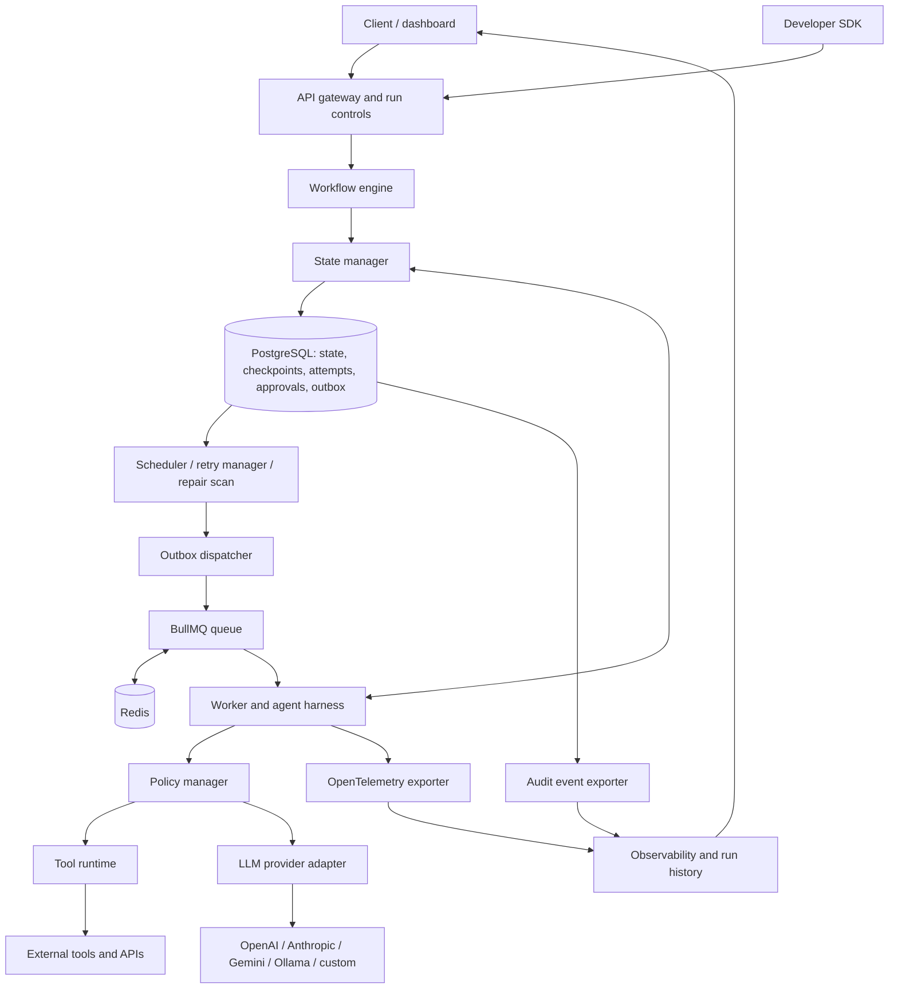
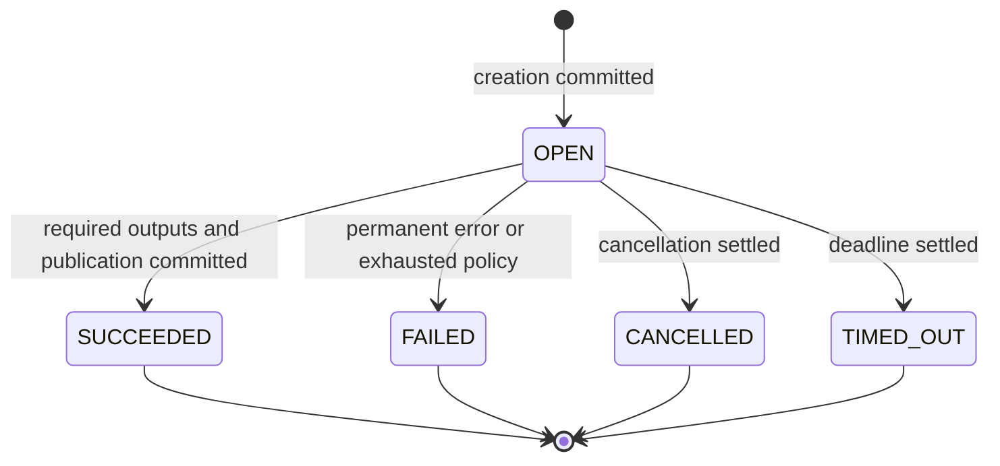

# AgentFlow — Durable Workflow Runtime for AI Agents

**Recommendation:** Build a small, model-independent runtime with explicit step boundaries, transactional PostgreSQL checkpoints, recoverable scheduling, and a side-effect contract that distinguishes safe retries from uncertain outcomes. Evaluate it through controlled fault injection. This is a credible distributed-systems engineering project; durability, agent checkpointing, and provider abstraction are established techniques, not new inventions.

This specification assumes two students and 12 implementation weeks. It is an architecture and research deliverable, not an implemented system. Numerical acceptance criteria below are proposed targets, not measured results. Technology documentation was checked on 12 September 2026; documentation dates in the matrix denote the surveyed snapshot, not product launch years. Academic papers and vendor documentation provide different kinds of evidence: papers motivate mechanisms and experiments; documentation establishes described product behavior, not comparative performance.

## 1. Problem Analysis

### 1.1 The engineering problem

An agent execution alternates between obtaining information, producing decisions, invoking tools, and updating state. In an ordinary in-memory loop, the process executing that loop also holds its progress. Losing that process can lose both the next instruction and the evidence needed to decide whether an earlier operation completed.

AgentFlow must preserve a recoverable execution record across **crash-stop failures, delayed or duplicated work delivery, and ambiguous responses from external systems**. Its job is to maintain the relationship between a logical operation, its attempts, its accepted result, and the workflow state derived from that result.

The central contract is:

> Once an operation's successful result is committed, recovery of that run reuses it. An unfinished operation is retried only when its execution contract permits retry; an uncertain unsafe side effect requires reconciliation.

“Completed” therefore means **durably committed**, not merely “the remote server performed it” or “the worker printed a check mark.” These are different events.

### 1.2 Why ordinary loops are fragile

| Fragility | Example | Required response |
|---|---|---|
| Volatile progress | Process dies after five successful calls | Persist outputs and continuation before acknowledging success |
| Ambiguous remote outcome | Email accepted, response lost | Reuse a receiver-supported key or reconcile; local retry alone is unsafe |
| Lost scheduling intent | Database commit succeeds, queue enqueue fails | Transactional dispatch intent plus repair scan |
| Duplicate delivery | Two workers receive the same operation | Atomic claim, lease, and stale-result rejection |
| Nondeterministic re-execution | Repeated LLM call chooses a different tool | Persist the accepted decision and stable action identity |
| Unbounded waiting | Reviewer responds tomorrow | Durable approval record; release worker resources |
| Retry amplification | SDK, worker, and workflow all retry | One owner for logical retry policy and a finite budget |
| Deployment drift | Old run resumes with a changed prompt or handler | Pin definition, handler, prompt, and adapter versions |

### 1.3 Checkpointing, retries, and idempotency

Checkpointing bounds lost progress. For the reference workflow, a crash during `analyze-features` should preserve the committed search, collection, and pricing outputs. It does not preserve an arbitrary JavaScript stack or automatically roll back actions in other systems.

Retries improve progress after transient failure but do not remember successful earlier work, repair a broken plan, or prove whether an external action happened. Backoff and jitter prevent retry bursts; they do not turn an unsafe operation into a safe one. AWS describes bounded retries with exponential backoff and jitter in its SDK retry model. [AWS retry behavior](https://docs.aws.amazon.com/sdkref/latest/guide/feature-retry-behavior.html)

Idempotency associates multiple attempts with one logical intent. It is particularly important when a request succeeds remotely but its acknowledgement is lost. A local deduplication table only resolves outcomes that the local system knows; a receiver-side contract is needed to close the remote acknowledgement gap. RIFL's stronger RPC semantics depend on atomically persisting the operation's effects and completion record within the participating system. [RIFL, §3](https://web.stanford.edu/~ouster/cgi-bin/papers/rifl.pdf)

### 1.4 Why approval requires durable state

An approval is an asynchronous decision about an exact proposed action. The runtime must remember the proposal, reviewer, decision, expiration, and continuation even if no worker is running. Repeated approval requests must not execute the continuation twice. A changed report, recipient, or publication target requires a new approval.

### 1.5 What makes agents distinctive

Agents introduce variable control flow, stochastic outputs, growing context, model-specific continuation data, costly repeated inference, and tool arguments supplied by a probabilistic component. A retry may change the answer rather than simply repeat a deterministic calculation. Some failures are semantic—invalid citations or a bad plan—and should not be classified as infrastructure failures.

AgentFlow therefore needs explicit message/tool history, schema validation, budgets, and recorded decisions. It need not capture private model reasoning: application-visible outputs, structured plans, tool calls, observations, and required opaque continuation data are sufficient. **Execution reliability does not imply report accuracy, safe reasoning, or guaranteed task completion.**

## 2. Literature Survey

### 2.1 AI-agent architectures and state

**ReAct — Yao et al., ICLR 2023; preprint 2022.** The problem is connecting reasoning with interaction. ReAct interleaves reasoning and actions, evaluates question answering and interactive environments, and updates behavior using observations. It motivates AgentFlow's alternating decision/action boundaries. Its contribution concerns agent behavior and task success; the paper does not establish a crash-recovery or external side-effect commit protocol. [ReAct](https://arxiv.org/abs/2210.03629)

**Toolformer — Schick et al., NeurIPS 2023.** The problem is teaching models when and how to use APIs. The mechanism is self-supervised training with tool-call examples and result incorporation. AgentFlow should accept structured tool intents regardless of how the model learned to produce them. Tool selection and reliable tool execution remain separate concerns; training a Toolformer-style model is outside this project. [Toolformer](https://proceedings.neurips.cc/paper/2023/hash/d842425e4bf79ba039352da0f658a906-Abstract-Conference.html)

**Plan-and-Solve — Wang et al., ACL 2023.** The paper addresses missing reasoning steps by first eliciting a decomposition and then solving its subtasks. This supports a conceptual planner/executor separation. It is a prompting approach, not a durable workflow scheduler. AgentFlow can persist a validated plan or use a fixed research workflow without claiming to reproduce the paper's reasoning results. [Plan-and-Solve](https://aclanthology.org/2023.acl-long.147/)

**MemGPT — Packer et al., 2023 preprint.** The problem is limited model context during extended interaction. It uses managed memory tiers and control-flow interrupts to move information between context and external storage. This motivates treating agent memory as explicit state. Memory management does not by itself specify transactional progress, tool deduplication, or recovery of an in-flight operation. A vector database is unnecessary for AgentFlow's MVP. [MemGPT](https://arxiv.org/abs/2310.08560)

**AutoGen research — Wu et al., 2023 preprint.** The problem is programming applications through interacting agents, tools, and humans. Conversable agents and configurable conversation patterns provide the mechanism. AgentFlow could eventually host such interactions as recorded operations, but multi-agent coordination increases scope. The original paper should not be treated as a specification of the current framework's durability guarantees. [AutoGen paper](https://arxiv.org/abs/2308.08155)

**Synthesis.** Agent architectures explain how to select and organize actions. Durable execution explains how to preserve accepted actions and outcomes. Long-lived memory, a long context window, and a process that runs for a long time are each different from crash-recoverable execution.

### 2.2 Workflow orchestration systems

**Temporal.** It addresses reliable long-running application execution using persisted event history and deterministic workflow replay. External work runs in activities with timeout and retry policies; signals provide asynchronous interaction. AgentFlow can learn from the separation of control flow and activities. Temporal already supports the broad durability thesis. AgentFlow's smaller explicit state machine sacrifices generality and ecosystem maturity; retries of externally visible activities still need suitable side-effect handling. [Workflow execution](https://docs.temporal.io/workflow-execution), [activity execution](https://docs.temporal.io/activity-execution)

**Azure Durable Functions / Durable Task.** It addresses stateful orchestration in an asynchronous compute environment. Execution history and deterministic replay reconstruct orchestrator state; activities perform external work. Durable timers and external events support approvals without retaining a waiting process. The lesson is to persist waiting conditions and isolate nondeterminism. Replay constraints, version compatibility, and host/backend configuration still matter. This is an existing solution, not evidence of a missing durability layer. [Durable orchestrations](https://learn.microsoft.com/en-us/azure/durable-task/common/durable-task-orchestrations), [external events](https://learn.microsoft.com/en-us/azure/durable-task/common/durable-task-external-events)

**AWS Step Functions.** It addresses managed service orchestration using explicit state machines. Standard workflows persist state between transitions and support long waits and callbacks. AWS documents Standard as exactly-once workflow execution, with explicit retries as an exception; asynchronous Express is at-least-once and synchronous Express at-most-once. These guarantees must not be generalized into an atomic transaction with an arbitrary email API. The relevance is explicit transition semantics; the tradeoff is AWS coupling and integration-specific behavior. [Workflow types and guarantees](https://docs.aws.amazon.com/step-functions/latest/dg/choosing-workflow-type.html)

**Inngest.** It provides durable functions through named steps, persisted results, and resumption that substitutes prior results. Steps can retry independently and wait for events. It directly overlaps with the proposed simple SDK and already offers agent-oriented capabilities. It demonstrates that convenient step APIs are established. AgentFlow should document its narrower execution model rather than claim a unique programming abstraction. External outcomes before a result is persisted remain a separate contract. [Execution mechanism](https://www.inngest.com/docs/learn/how-functions-are-executed), [durable primitives](https://www.inngest.com/platform/durable-execution)

**Restate.** It addresses durable service and workflow execution through a journal, recorded operation results, and replay. Its architecture uses attempt epochs to reject superseded results; its SDK wraps nondeterministic work in durable steps. Durable-agent examples already persist inference and tool results. AgentFlow can borrow the distinction between an attempt and an accepted result. Journal guarantees apply after commit; receiver cooperation remains necessary for an external operation interrupted before that commit. [Architecture](https://docs.restate.dev/references/architecture), [durable steps](https://docs.restate.dev/develop/ts/durable-steps), [durable agents](https://docs.restate.dev/ai/patterns/durable-agents)

**Hatchet.** It provides queued tasks and durable workflows backed by persisted execution state. Durable tasks wait on durable conditions or invoke child tasks, allowing replay after worker failure. It already targets agents, approvals, and dynamic workflows. Its relevance is the worker/engine split and releasing execution resources while waiting. AgentFlow will implement a much smaller subset; successful checkpoints should not be confused with proof that an unacknowledged child side effect did not happen. [Hatchet overview](https://docs.hatchet.run/v1), [durable execution](https://docs.hatchet.run/v1/durable-execution)

**DBOS — an essential additional comparator.** DBOS provides a library that checkpoints workflows and steps in PostgreSQL and resumes by returning saved outputs during deterministic re-execution. It also has database-backed queues and agent integrations. This directly undermines novelty claims based on “lightweight,” “PostgreSQL-backed,” or “durable agents.” AgentFlow's value must be its educational implementation and controlled evaluation of explicit contracts. DBOS also documents that unfinished steps should be idempotent. [DBOS architecture](https://docs.dbos.dev/architecture), [DBOS Vercel AI integration](https://github.com/dbos-inc/dbos-vercel-ai)

**Comparative judgment.** For a production application, adopting one of these systems is usually more defensible than creating another general-purpose orchestrator. For a minor project intended to demonstrate distributed-systems design, implementing a deliberately restricted runtime is reasonable if its guarantees and omissions are measured and disclosed.

### 2.3 Agent frameworks

**LangGraph.** It addresses stateful agent control flow using graphs and checkpointed state. Persistent checkpointers support recovery, human interrupts, and reuse of completed results; its functional API explicitly addresses nondeterminism and idempotent tasks. It is a direct intersection of agent frameworks and durability. AgentFlow cannot claim that frameworks lack these features. The useful comparison is behavior at defined commit boundaries under a matched fault model and backend configuration. [Persistence](https://docs.langchain.com/oss/javascript/langgraph/persistence), [functional API](https://docs.langchain.com/oss/javascript/langgraph/functional-api)

**OpenAI agent tooling.** The Agents SDK supplies an application-controlled agent loop, tools, handoffs, tracing, and resumable approval state. Provider adapters are available; it is inaccurate to label the SDK categorically OpenAI-only. Current official documentation also describes a managed Agents API that saves progress for long-running tasks. Distinguish these products from raw model calls. AgentFlow's comparison concerns independent execution ownership and its explicit external side-effect protocol; SDK history storage alone does not establish that protocol. [Runtime comparison](https://developers.openai.com/api/docs/guides/agents), [results and state](https://developers.openai.com/api/docs/guides/agents/results), [models and providers](https://developers.openai.com/api/docs/guides/agents/models), [observability](https://developers.openai.com/api/docs/guides/agents/integrations-observability)

**AutoGen framework.** Current state APIs serialize and restore agent/team state, and documented human-feedback patterns save state between runs. It is useful for message-driven agent collaboration. Persistence must be integrated into application lifecycle at appropriate boundaries; a saved conversation is not automatically an atomic record of a tool's external effect. Compare a named configuration, not an unqualified claim that AutoGen has or lacks all durability. [Managing state](https://microsoft.github.io/autogen/stable/user-guide/agentchat-user-guide/tutorial/state.html), [human interaction](https://microsoft.github.io/autogen/stable/user-guide/agentchat-user-guide/tutorial/human-in-the-loop.html)

**CrewAI.** Flows provide state, routing, persistence decorators, and human-feedback pauses. The inspected version documents SQLite as the default persistence backend and custom persistence implementations. This is substantial overlap with AgentFlow's state and approval features. The remaining question is the precise atomicity of state, scheduling, and remote effects under a selected deployment; do not equate the persistence decorator with end-to-end effect deduplication. [CrewAI Flows, versioned documentation](https://docs.crewai.com/v1.15.21/en/concepts/flows)

**LlamaIndex Workflows.** It supports event-driven steps and serializable workflow context. Current durable-workflow guidance describes checkpoint loops, restoring pending events and partial fan-in, and restarting unfinished steps. It explicitly describes at-least-once resumption and repeat-safe side effects. This is a particularly useful comparator for checkpoint placement and repeated-work measurements. Application checkpoint frequency and persistence handling affect the recovery boundary. [Writing durable workflows](https://developers.llamaindex.ai/python/llamaagents/workflows/durable_workflows/)

### 2.4 Reliability and distributed-systems foundations

**Chandy–Lamport, ACM TOCS 1985.** The problem is capturing a consistent global state of communicating processes. The mechanism records process and channel state using markers under its communication assumptions. The relevance is consistency: independently saved pieces can describe an impossible execution. AgentFlow avoids implementing distributed snapshots by committing its authoritative control state in one PostgreSQL transaction. The paper's algorithm is not a replacement for external API idempotency. [Distributed snapshots](https://www.cs.princeton.edu/courses/archive/fall17/cos418/papers/chandy_lamport.pdf)

**Elnozahy et al., ACM Computing Surveys 2002.** This work organizes checkpoint-based and log-based rollback recovery, including consistent recovery and interactions with the outside world. AgentFlow uses the application-level version of this idea: preserve accepted nondeterministic inputs/results and a restart boundary. It does not implement arbitrary process rollback. The outside-world/output-commit problem is a reason to treat remote side effects separately. The accessible author-hosted copy is a draft; the final publication is ACM Computing Surveys 34(3), 375–408. [Author-hosted survey](https://www.cs.utexas.edu/~lorenzo/corsi/cs380d/papers/survey.pdf), [publication record](https://www.cs.rice.edu/~dbj/pubs.html)

**RIFL — Lee et al., SOSP 2015.** It addresses duplicate RPC execution and linearizability through stable request identity, durable completion records, and lease-based record reclamation. It motivates AgentFlow's durable result ledger and retention policy. Its participating storage system can atomically commit effects and completion; arbitrary HTTP providers cannot be assumed to participate. AgentFlow therefore promises narrower, conditional semantics. [RIFL](https://web.stanford.edu/~ouster/cgi-bin/papers/rifl.pdf)

**Sagas — Garcia-Molina and Salem, 1987.** Long transactions are decomposed into smaller transactions with compensating actions. AgentFlow may eventually use this for multi-step external changes. Compensation is a business operation, can fail, and does not literally erase an email or undo every observation by another service. Generic compensation is future work; a publication/notification step placed last is a simpler MVP. [Sagas, Princeton technical report](https://www.cs.princeton.edu/techreports/1987/070.pdf), [Restate saga implementation guidance](https://docs.restate.dev/guides/sagas)

**AWS idempotent APIs and transactional outbox.** Caller-provided request identity makes retries correspond to the same intent; checking request parameters prevents reuse for a different intent. The outbox pattern persists business state and dispatch intent in one transaction and publishes afterward. AgentFlow needs both concepts. An outbox closes the database/queue dual-write gap but may publish twice, so the consumer must still deduplicate. [Idempotent APIs](https://aws.amazon.com/builders-library/making-retries-safe-with-idempotent-APIs/), [transactional outbox](https://docs.aws.amazon.com/prescriptive-guidance/latest/cloud-design-patterns/transactional-outbox.html)

**Stonebraker et al., CIDR 2026.** This paper examines consistency and correctness of data-oriented workflows, including external services, compensation, and long user stalls. It strengthens the distinction between durable progress and transactional correctness of the overall business process. Its relevance is architectural caution: AgentFlow should use short local transactions and explicitly bound external guarantees. Its broader consistency mechanisms are beyond this MVP. [Consistency and Correctness in Data-Oriented Workflow Systems](https://www.vldb.org/cidrdb/papers/2026/p9-stonebraker.pdf)

**State machines and event sourcing.** Explicit states make legal transitions inspectable. Event sourcing reconstructs state from an authoritative event stream, but adds replay, event evolution, and projection complexity. AgentFlow should instead use authoritative relational state plus immutable audit events committed alongside it. That is an audited transactional state machine, not a claim of full event sourcing. [Event sourcing pattern](https://learn.microsoft.com/en-us/azure/architecture/patterns/event-sourcing)

### 2.5 Human-in-the-loop and asynchronous execution

Durable Functions external events, Temporal signals, LangGraph interrupts, and CrewAI feedback flows all demonstrate that approval waiting is established functionality. For AgentFlow, the useful design question is how approval remains bound to the exact action across restart, duplicate delivery, timeout, and cancellation. A durable wait should consume a record, not a worker slot. The authorization decision must come from an authenticated human action, not an LLM's interpretation of text that resembles approval. [Durable external events](https://learn.microsoft.com/en-us/azure/durable-task/common/durable-task-external-events), [LangGraph persistence](https://docs.langchain.com/oss/javascript/langgraph/persistence)

### 2.6 AgentOps and observability

**Dapper — Sigelman et al., Google technical report 2010.** It addresses reconstructing request behavior across many services using trace context, spans, selective instrumentation, and sampling. AgentFlow needs causal links from a run to its operations, attempts, and provider calls. Tracing helps explain failures; sampled traces cannot be the authoritative recovery record. [Dapper](https://research.google/pubs/dapper-a-large-scale-distributed-systems-tracing-infrastructure/)

**OpenTelemetry.** It standardizes telemetry representation and propagation across libraries/backends. GenAI conventions cover model/tool metadata and usage; the official site now points to a dedicated GenAI conventions repository. AgentFlow should pin its telemetry schema version, preserve provider-reported usage, and keep content capture opt-in. Token counts, cached-token accounting, and pricing are not automatically identical across providers. [OpenTelemetry conventions](https://opentelemetry.io/docs/specs/semconv/), [GenAI conventions](https://github.com/open-telemetry/semantic-conventions-genai)

**AGENTCHAOSBENCH — Zhang et al., August 2026 preprint.** It studies detection and localization of injected operational faults from agent telemetry. The mechanism is controlled boundary-level fault injection over heterogeneous applications. AgentFlow can adopt the experimental principle of labeled failure points, but should measure recovery and side-effect safety rather than claim novelty for agent fault injection. This is recent preprint evidence, not an established recovery protocol or a peer-reviewed endorsement of AgentFlow. [When Agentic Executions Fail](https://arxiv.org/abs/2608.14680)

**Observability conclusion.** Store audit events and usage records in PostgreSQL; export traces, metrics, and redacted logs separately. A dashboard that shows green steps without a committed recovery record is monitoring, not durability.

## 3. Literature Survey Matrix

The matrix is intentionally explicit about scope. **App** means application/integration responsibility; **N/A** means the source does not propose that runtime feature. “Conditional” means the guarantee depends on receiver behavior or deployment configuration. Product rows use the 2026 documentation snapshot. Source links and mechanisms are discussed in Section 2; absence from a paper's scope is not a claim that an associated modern product cannot support the feature.

| System/Paper | Year | Problem | Architecture | Durability Mechanism | Checkpointing | Retries | Idempotency | Human-in-the-loop | Observability | AI-agent support | Limitations | Relevance to AgentFlow |
|---|---|---|---|---|---|---|---|---|---|---|---|---|
| ReAct | 2023; preprint 2022 | Reason/action integration | Interleaved agent loop | Not specified | N/A | Behavioral adaptation | N/A | Not core | Task trajectories | Core subject | No crash protocol | Decision/action boundaries |
| Toolformer | 2023 | Learn API use | Self-supervised tool training | Not specified | N/A | N/A | N/A | Not core | Research evaluations | Core subject | Training is separate from execution safety | Tool-intent abstraction |
| Plan-and-Solve | 2023 | Missing reasoning steps | Plan then solve | Not specified | N/A | N/A | N/A | Not core | Reasoning evaluations | Planning precursor | Prompt strategy, not runtime | Persist accepted decomposition |
| MemGPT | 2023 preprint | Limited context | Tiered agent memory | Memory management | Memory/state, not a commit protocol | App | App | Interactive control | Interaction records | Native | Memory is not side-effect recovery | Explicit context state |
| Temporal | 2026 docs | Reliable orchestration | Service, SDK, workers | History/replay | Recorded workflow progress | Activities/policies | External activity contract | Signals/waits | History/UI/tracing | Workflows can host agents | Replay/version constraints; remote ambiguity | Strong existing reference |
| Azure Durable Functions | 2026 docs | Stateful asynchronous work | Orchestrators and activities | History/replay | Durable state/history | Policies | External activity contract | External events/timers | Diagnostics/history | Activities can host agents | Determinism and backend configuration | Durable waits |
| AWS Step Functions | 2026 docs | Managed service coordination | Explicit state machine | Standard transition persistence | Standard state boundaries | Retry/Catch | Mode and integration dependent | Standard callbacks | History/CloudWatch | Service/task composition | Standard/Express differ; AWS coupling | Explicit semantics |
| Inngest | 2026 docs | Durable application functions | Engine plus named steps | Stored step outputs | Named steps | Per-step behavior | Invocation controls; effects conditional | Event waits | Run/step traces | Agent-oriented features | Runtime and external API contracts | Simple SDK reference |
| Restate | 2026 docs | Durable services/agents | Journal plus service handlers | Journal replay, attempt epochs | Durable operation results | Configurable | Invocation keys; effects conditional | Durable waits/promises | Journal/UI/traces | Explicit durable-agent patterns | Journal commit boundary matters | Result reuse and fencing |
| Hatchet | 2026 docs | Reliable task execution | Engine, workers, durable tasks | Durable event log | Child/wait boundaries | Task retries | Run controls; effects conditional | Durable event waits | UI/logging/history | Explicit | Durable-task restrictions | Worker separation |
| DBOS | 2026 docs | Lightweight durable execution | Library plus PostgreSQL | Recorded inputs/results and replay | Workflow/step records | Step/workflow mechanisms | DB participation; external steps must be safe | Durable messaging; app approval logic | Conductor/integrations | Agent integrations | Version constraints; remote side effects | Closest lightweight comparator |
| LangGraph | 2026 docs | Stateful agent control | Graph plus checkpointer | Persisted graph/task state | Step/super-step state | Node/task policy | Task/receiver responsibility | Interrupt/resume | State/history; ecosystem tracing | Native | Boundary/backend configuration matters | Direct durable-agent reference |
| OpenAI Agents SDK | 2026 docs | Application agent orchestration | Runner/tools/handoffs | Sessions and resumable state; storage owned by app | Approval/run-state surfaces | Layer/integration dependent | Tool/receiver responsibility | Approval interruptions | Built-in tracing | Native; adapter support | Storage is not universal external atomicity | Harness/API comparison |
| OpenAI managed Agents API | 2026 docs | Managed long-running agents | Hosted harness and sessions | Service-managed saved progress | Managed session progress | Service-defined | Tool/integration contract | Integration-specific controls | Session/usage/tracing | Native | Provider/platform ownership; inspect exact contract | Current managed alternative |
| AutoGen | 2023 paper; 2026 docs | Multi-agent collaboration | Conversable/message-based agents | App persists serialized state | Save/load boundaries | App/integration | App/receiver | User proxy/feedback | Events/tracing integrations | Native | Boundary persistence must be integrated | Future harness integration |
| CrewAI Flows | 2026 docs | Agent/team workflows | Flow methods, routing, state | Persistence decorator/backend | Method/class persistence | Configuration dependent | App/receiver | Human-feedback flows | Flow/event integrations | Native | State persistence is not end-to-end effect dedup | Approval/state comparison |
| LlamaIndex Workflows | 2026 docs | Event-driven agent workflows | Steps/events/context | Serialized context recovery | App checkpoint loop | Retry/resume semantics | Repeat-safe side effects required | Workflow interaction | Events/instrumentation | Native | Unfinished steps rerun; checkpoint timing matters | Boundary-frequency experiment |
| Chandy–Lamport | 1985 | Consistent global snapshots | Processes plus channels | Consistent snapshot algorithm | Global snapshot | N/A | N/A | N/A | State observation | Generic | Communication assumptions; no remote API atomicity | Consistency foundation |
| Rollback-recovery survey | 2002 | Recovery protocol taxonomy | Checkpoint/log-based models | Stable checkpoints/logs | Core subject | Recovery/replay | Outside-world problem | N/A | N/A | Generic | Not an agent implementation | Bound lost work |
| RIFL | 2015 | Duplicate RPC/linearizability | Request IDs and completion records | Atomic result/effect records | Completion ledger | RPC retransmission | Strong within participating system | N/A | Not central | Generic | Requires atomic receiver integration | Conditional guarantee boundary |
| Sagas | 1987 | Long transaction failure | Local transactions/compensations | Recovery through compensations | Transaction boundaries | Business-dependent | Compensation must be safe | Not central | Not central | Generic | Cannot undo every external effect | Future compensation |
| Data-oriented workflow correctness | 2026 | Workflow consistency | DB-backed workflows | Transactions/logging; backout mechanisms | Step/state records | Recovery mechanisms | External service limitations | User-stall analysis | Provenance/state | Generic | Long locks and irreversible effects | Avoid oversized transactions |
| Dapper | 2010 | Cross-service diagnosis | Trace/span propagation | No workflow durability | N/A | N/A | N/A | N/A | Core subject | Generic | Sampling is not an audit ledger | Trace correlation |
| OpenTelemetry | 2026 docs | Portable telemetry | Instrumentation/exporters | No workflow durability | N/A | N/A | N/A | Traceable events | Core subject | GenAI conventions | Schema evolution; incomplete usage possible | Provider-neutral telemetry |
| AGENTCHAOSBENCH | 2026 preprint | Detect/localize runtime faults | Boundary fault injection plus traces | No recovery runtime proposed | N/A | Fault scenarios | Not main question | Guardrail scenarios | Core evidence | Native benchmark | Detection differs from recovery | Reproducible experiments |

## 4. Research Gap

### 4.1 What is already solved

Durable orchestration, persistent timers, retries, event waiting, activity histories, agent checkpointing, human interrupts, and provider adapters all exist. Several surveyed products directly combine them. A gap framed as “agent frameworks cannot resume” or “workflow engines do not support agents” would be indefensible.

### 4.2 A defensible project contribution

Investigate a **small, inspectable execution contract for a bounded research agent**, then measure the cost and safety consequences of that contract under specified faults. The experimental contribution can include a reproducible fault injector, operation-level ground truth, and an evaluation that distinguishes committed progress, uncertain provider outcomes, and actual external effects.

This is a scoped engineering investigation. It is not a claim that no one has measured durability or injected agent faults before. Stronger publishable novelty would require a further systematic comparison and a demonstrably new result after implementation.

**Primary research question:**

> Under controlled worker and dependency failures, how much does transactional step checkpointing with capability-aware side-effect recovery improve research-agent completion, repeated work, and observable side-effect safety compared with the same agent using bounded retries and volatile state?

**Secondary research questions:**

1. How does checkpoint granularity trade persistence overhead against repeated inference, tokens, and recovery latency?
2. How do receiver-supported idempotency and explicit uncertain-outcome handling change duplicate effects and unresolved runs?
3. Can approval decisions remain bound to the reviewed payload across restart, duplicate requests, expiration, and cancellation?
4. Does the same execution contract hold for two different model-provider adapters without provider-specific logic in the engine?
5. How closely does the restricted implementation match a configured existing durable runtime on the shared test scenarios, and what complexity or functionality is traded away?

### 4.3 Contribution boundaries

The deliverables are the runtime specification and implementation, the benchmark, evidence for the stated invariants, and measured tradeoffs. Better reasoning, a new consensus algorithm, universally exactly-once tools, and outperforming production orchestrators are not promised. Use DBOS or LangGraph as a reference system for a limited common subset; do not build integrations with every surveyed framework.

## 5. Requirements

### 5.1 MVP functional requirements

| ID | Requirement | Acceptance evidence |
|---|---|---|
| F1 | Register immutable workflow versions with stable node/handler identifiers | A run remains pinned after a new definition is registered |
| F2 | Create and start runs through an idempotent API | Repeated creation token returns one run; altered payload conflicts |
| F3 | Execute sequential LLM, tool, transform, and approval operations | Reference workflow completes with recorded outputs |
| F4 | Commit result, state, checkpoint, history, and next-dispatch intent atomically | Crash tests show either old state or complete new state |
| F5 | Recover unfinished work after process restart | Committed operations are reused within the same run |
| F6 | Retry classified transient failures with backoff, jitter, deadlines, and attempt limits | Attempt ledger matches configured policy |
| F7 | Prevent stale workers from committing authoritative results | Old lease epoch update is rejected |
| F8 | Pause, resume, cancel, and expire runs durably | Controls survive restart and suppress future dispatch |
| F9 | Create and resolve authenticated approval gates | Duplicate/rejected/expired approvals cannot release an action |
| F10 | Support receiver-idempotent effects and uncertain-outcome reconciliation | Remote success/local crash test produces one effect or explicit uncertainty |
| F11 | Execute allowlisted tools through the harness | Invalid arguments and unapproved operations are blocked |
| F12 | Record bounded agent turns individually | Recovery does not rerun an entire opaque agent loop |
| F13 | Offer a provider contract and two real adapters | Same workflow definition runs with either provider |
| F14 | Expose history, attempts, usage, and terminal outcomes | Evidence export supports evaluation independently of the UI |
| F15 | Repair missing queue delivery from PostgreSQL state | Clearing disposable queue data does not lose committed runs |

### 5.2 MVP non-functional requirements

| Area | Proposed requirement and boundary |
|---|---|
| Reliability | Zero observed re-execution of durably completed logical operations within a run in boundary tests; finite retryable workflows eventually progress after dependencies recover |
| Consistency | One accepted completion per logical operation; atomic checkpoint publication; durable request/approval deduplication |
| Fault tolerance | Recover after worker/API/Redis restart and temporary PostgreSQL outage when durable database storage survives |
| Performance | On documented local hardware, target p95 checkpoint transaction under 100 ms at five active runs; measure rather than assume |
| Recovery | With a 15 s database lease and 2 s repair interval, target p95 crash-to-next-dispatch under 25 s at low load after services are available |
| Observability | Every accepted transition and attempt has stable IDs; audit history survives telemetry exporter failure |
| Extensibility | Provider/tool adapters cannot change workflow scheduling semantics; schemas are versioned |
| Security | Authenticated run controls, owner/reviewer checks, server-only credentials, approved target allowlists, schema and payload limits |
| Bounded resource use | Finite steps/turns/attempts; per-run deadline; concurrency limits; storage-size limit |
| Maintainability | Documented invariants and one canonical retry policy; no hidden in-memory recovery dependencies |

Do not claim high availability from a single PostgreSQL container. Durability depends on persistent volumes, appropriate database commit settings, and healthy storage. A machine restart with an intact volume is in scope; permanent loss of the only database disk is not. PostgreSQL WAL provides database crash-recovery machinery, which AgentFlow uses rather than reimplements. [PostgreSQL WAL](https://www.postgresql.org/docs/current/wal-intro.html)

### 5.3 Future requirements

Parallel DAG scheduling, arbitrary dynamic graph mutation, multi-agent teams, live workflow migration, framework plugins, automatic provider failover, generic compensation, untrusted-code sandboxing, multi-tenant quotas, multi-region deployment, high-availability database operations, visual workflow editing, and production billing are future work.

## 6. AgentFlow Architecture

### 6.1 Physical deployment

Use **two application process types**: an API/control process and a worker process. The API process also hosts the scheduler, retry manager, outbox dispatcher, and reconciliation scan. Run one scheduler initially. Additional worker instances can share PostgreSQL and Redis. These are logical modules, not a proposal for a dozen microservices.

The diagram shows logical communication. In the MVP, worker-side state-manager functions use a restricted PostgreSQL role directly; they do not call the API for every heartbeat. PostgreSQL remains private to trusted runtime processes. The SDK is a definition/submission surface, not a way to upload arbitrary executable code to the API.

### 6.2 Responsibilities and communication

| Component | Responsibility | Communication and persistence |
|---|---|---|
| Client | Submit input, inspect progress, pause/cancel, review proposals | HTTP API; polling initially |
| Agent SDK | Define named operations, agent policy, tool schemas, versioned workflow | Registers metadata; submits runs; handlers ship with workers |
| API gateway | Authentication, ownership, validation, request deduplication | Commits commands through engine/state manager; returns run ID promptly |
| Workflow engine | Validate legal transitions and determine next operation | Pure transition decisions plus short database transactions |
| Scheduler | Find eligible work and elapsed waits | Reads indexed due rows; creates dispatch intents transactionally |
| Queue | Deliver operation references to available workers | BullMQ using Redis; duplicate/lost messages are tolerated |
| Workers | Claim and execute one operation attempt at a time per run | Database lease/heartbeat; adapters; guarded result commit |
| State manager | Enforce run/step invariants and atomic mutations | Canonical transaction boundary for claims, results, approvals, controls |
| Checkpoint store | Preserve immutable committed snapshots | PostgreSQL table; linked from the current run |
| Retry manager | Classify failures, compute durable retry time, enforce budgets | Module inside engine/scheduler; one logical retry authority |
| Tool runtime | Validate and invoke registered tools, propagate keys/timeouts | Tool registry plus durable tool-execution ledger |
| LLM provider adapter | Translate requests, responses, usage, errors | Provider SDK/HTTP transport; no workflow ownership |
| Policy manager | Enforce allowlists, approval prerequisites, limits | Pinned policy plus current authorization checks before dispatch |
| Event/trace bus | Carry audit notifications and diagnostic telemetry | Audit rows/outbox plus OTel export; no Kafka required |
| Observability layer | Show transitions, attempts, timings, usage, blocked outcomes | PostgreSQL history API plus optional trace backend |
| PostgreSQL | Authoritative execution and control state | Transactions, unique constraints, row locks, WAL |
| Redis | Queue transport and disposable coordination/cache data | Reconstructible from authoritative PostgreSQL work state |

### 6.3 The database/queue boundary

Do not perform “save state, then enqueue” as two unrelated operations. Creation or progression commits a dispatch-intent row in the same transaction as the run/step state. A dispatcher publishes its ID, then records publication. If it crashes after publication, publication may repeat. A periodic scan repairs eligible steps that remain unclaimed even if an earlier publication was marked delivered and Redis later lost it.

Queue presence never proves that work should execute. A worker validates eligibility in PostgreSQL. The outbox solves missing dispatch intent; claims and result uniqueness solve duplicated delivery. This is the application of the transactional outbox pattern, with an additional repair scan for the chosen reconstructible transport. [Transactional outbox](https://docs.aws.amazon.com/prescriptive-guidance/latest/cloud-design-patterns/transactional-outbox.html)

### 6.4 Key architecture decisions

| Decision | Rationale | Cost accepted |
|---|---|---|
| Explicit persisted workflow state | Easier to inspect and implement in 12 weeks | No arbitrary async-function replay |
| One running operation per run | Avoid parallel state merge and join races | Lower throughput within one research run |
| Concurrency across runs | Demonstrates distributed workers without complex DAG logic | Some long workflows remain sequential |
| Short PostgreSQL transactions | Avoid holding database locks during inference or approvals | Remote effects require a separate protocol |
| Immutable workflow and handler versions | Recovery uses the original behavior | Old compatible worker builds must remain available |
| One retry authority | Prevent multiplicative retries | Provider SDK defaults must be configured or exposed |
| No untrusted custom code | Keep security boundary credible | Users choose registered tools rather than upload code |

## 7. Workflow Execution Semantics

### 7.1 Units and invariants

A **workflow** is a named reusable definition; a **version** is immutable; a **run** is one invocation. A **logical operation** is one uniquely identified LLM call, tool call, transform, or approval gate. An **attempt** is one claimed try at that operation. A **checkpoint** is an immutable snapshot of accepted progress.

Use a stable logical identity such as `(run_id, node_key, occurrence)`. The fixed workflow has occurrence zero; bounded agent turns use a persisted turn number. Provider-generated tool-call IDs are retained for protocol correctness but do not replace runtime identity.

Required invariants:

1. One logical operation can have many attempts but at most one accepted successful result.
2. A committed success is never dispatched again within the same run.
3. State, checkpoint reference, accepted result, and successor eligibility agree at commit.
4. Every accepted result belongs to the current unexpired lease epoch.
5. Approved execution uses the exact authorized payload and target.
6. Terminal runs do not start additional operations.
7. Lost queue messages cannot erase durable scheduling intent.
8. Recovery does not regenerate an already committed LLM decision.

These are invariants to test. Liveness additionally assumes eventual dependency availability, compatible workers, finite work, and sufficient retry/deadline budget.

### 7.2 Explicit state machine

Use three stored fields to avoid conflating a human wait with an operator pause:

| State dimension | Values |
|---|---|
| Run lifecycle | `OPEN`, `SUCCEEDED`, `FAILED`, `CANCELLED`, `TIMED_OUT` |
| Operator control | `RUN`, `PAUSE_REQUESTED`, `PAUSED`, `CANCEL_REQUESTED` |
| Waiting reason while open | `NONE`, `RETRY`, `APPROVAL`, `RECONCILIATION` |

The public status is derived: an open run is `RUNNING` with a valid attempt, `QUEUED` with eligible work, `RETRY_WAIT`, `WAITING_APPROVAL`, or `NEEDS_ATTENTION` for reconciliation. Creation is an audit event; the initial committed run already has its first operation materialized. Operator control takes precedence in display. Persist enough fields to compute this unambiguously; do not let a queue event independently overwrite run status.

Within `OPEN`, controls and waits follow this transition table:

| Trigger | Preconditions | Durable mutation | Next scheduling behavior |
|---|---|---|---|
| Ready work | Control RUN, no blocking wait | Operation READY and dispatch intent | Worker may claim |
| Claim | Dependencies committed; deadline valid; no valid claim | Operation RUNNING, new attempt and lease epoch | Exactly one accepted claimant |
| Success | Current lease; output valid | Result/checkpoint/successor in one transaction | Next operation becomes READY or gate waits |
| Retryable error | Attempts/time remain; repeat permitted | Attempt error; step RETRY_WAIT; due timestamp | No worker held during backoff |
| Retry timer due | Control RUN and policy still valid | RETRY_WAIT to READY | Publish dispatch intent |
| Approval gate reached | Required predecessor committed | Pending approval plus wait reason APPROVAL | Release worker |
| Approval accepted | Authenticated reviewer; matching payload; unexpired | Decision, gate success, checkpoint | Clear wait; dispatch only if control RUN |
| Approval rejected/expired | Pending gate | Decision and terminal failure reason | No publication |
| Pause command | Open run | PAUSE_REQUESTED, or PAUSED if quiescent | No new claims; active attempt may finish |
| Active attempt settles during pause | PAUSE_REQUESTED | Commit its permitted result, then PAUSED | Preserve the underlying wait condition |
| Resume command | Paused run | Control RUN | Re-evaluate wait; does not approve or reset timers |
| Unsafe uncertain outcome | Remote effect cannot be established | Wait RECONCILIATION; operation UNKNOWN | No automatic resend |
| Reconciliation decision | Verified evidence or explicit operator resolution | Record resolution and continuation | Retry only if safe; otherwise remain blocked/terminate |
| Cancellation command | Open run | CANCEL_REQUESTED; invalidate pending approvals | Stop claims; request in-flight abort |
| Cancellation settles | No active authoritative attempt | Lifecycle CANCELLED | Retain all effect outcomes/uncertainty |

A step has the states `PENDING → READY → RUNNING → SUCCEEDED`. Alternative exits from RUNNING are `RETRY_WAIT`, `FAILED`, `UNKNOWN`, or `CANCELLED`. Retry moves through READY again; UNKNOWN moves only through reconciliation. An approval step uses `WAITING_APPROVAL → SUCCEEDED/FAILED/CANCELLED`. A lease-lost attempt is `ABANDONED`; that attempt never becomes the winning success later.

### 7.3 Creation through completion

1. Validate input, workflow version, limits, owner, and creation idempotency token. Atomically create the run, initial state/checkpoint, first operation, event, and outbox intent. Return the run ID only after commit.
2. The dispatcher publishes a reference. A worker reads current PostgreSQL state and atomically claims the eligible operation using a row lock or compare-and-set update. Claiming allocates the attempt number and fencing epoch.
3. The worker freezes exact input and relevant policy/approval evidence. A tool's durable invocation intent must exist before any external send. The call runs outside the database transaction.
4. On successful response, validate the output and commit the accepted result, usage, state, checkpoint, audit event, and next operation in one short transaction. Reject completion from an expired/superseded lease. Only then acknowledge queue completion.
5. On failure, classify the error and outcome certainty. Persist either a retry due time, terminal error, or UNKNOWN requiring reconciliation. A timeout does not establish that the provider did nothing.
6. Recovery finds durable unfinished work and expired claims. It reuses committed results and schedules only eligible unfinished operations. It never trusts an in-memory cursor or an old queue message.
7. After report generation, create a gate for the report hash and intended publication payload. Approval is persisted independently of a live worker. After approval, publish through the idempotency contract.
8. Mark the run SUCCEEDED only when all required operations, including publication, have accepted results. A draft awaiting review is not successful completion.

### 7.4 Pause, cancellation, deadlines, and races

Pause is cooperative and takes effect at operation boundaries. If an operation was already authorized for external dispatch when pause or cancellation committed, the remote system may still complete it. The UI must distinguish “cancellation requested” from “cancelled.” Cancellation means AgentFlow will schedule no more work, not that prior external effects have been undone.

Serialize competing control and completion changes by locking the run row. If cancellation commits first, a subsequent response may be recorded as evidence in the tool/attempt ledger but cannot advance workflow progress. If completion commits first, its result remains accepted, while cancellation prevents successors from being claimed. An approval received during pause can be recorded but does not unpause the run. Late approval after cancellation or expiry is rejected as a state conflict.

Use separate deadlines for an attempt, the whole run, and an approval. The whole-run deadline includes pauses unless the definition explicitly states otherwise; MVP pauses do not extend it. If no process is running at deadline time, the scheduler applies expiry after restart. Expiration/cancellation can leave an external outcome UNKNOWN, which must remain visible even on a terminal run.

### 7.5 Retry policy

Proposed default: three total attempts, initial backoff 1 s, multiplier 2, cap 30 s, full jitter. For failed attempt number `a`, calculate `cap_a = min(30 s, 1 s × 2^(a−1))` and sample uniformly between zero and `cap_a`. Persist the sampled due time once. Honor a provider's valid Retry-After as a lower bound, subject to the run deadline. Infrastructure defaults are adjustable per tool/provider; permanent validation/authentication failures do not use blind retries.

A “repair prompt” changes the logical inference request and is a new bounded agent operation, not a transport retry of the old request. Default provider SDK automatic retries should be disabled where supported; otherwise record and bound the hidden transport retries separately.

## 8. Failure Model

The MVP assumes non-malicious runtime processes, durable PostgreSQL storage that survives the tested outages, and external services whose published contracts are respected. Byzantine workers, permanent loss of the only database copy, and arbitrary untrusted code are outside the guarantee. A network delay and a dead worker cannot always be distinguished; lease expiry is a suspicion that permits recovery, not proof that the old process stopped.

In the table, **safe retry** means either a repeatable computation/read or a receiver-supported idempotent write. Every attempt requires local identity; the final column concerns additional external side-effect protection.

| Failure | Detection | Persistence behavior | Retry behavior | Recovery | External idempotency needed? |
|---|---|---|---|---|---|
| LLM timeout | Attempt deadline; transport abort | Save request identity, timeout, unknown usage if necessary | Bounded retry of same request; new output possible | Use prior committed outputs; rerun only unfinished call | For guaranteed single billing/hosted effects, provider support is needed; local cache is insufficient |
| LLM API failure | HTTP/provider error classification | Save code, retry hint, request ID if known | Retry transient throttling/availability; stop invalid credentials/input | Resume call when due | If the request causes provider-hosted side effects |
| Malformed LLM output | Schema validation | Preserve invalid response and usage | Limited repair as a new operation, or fail | Never execute unvalidated tool arguments | For any eventual write |
| Tool timeout | Tool deadline or lost connection | Mark ambiguous write UNKNOWN; retain exact intent | Safe retry only | Query receiver/key or request review | Yes for writes |
| Tool failure | Typed exception/status | Error, outcome certainty, retryability | Transient/repeat-safe only | Continue after retry or terminal failure | Yes for writes that may have partially happened |
| Worker crash | Expired database lease; BullMQ stall | Last committed checkpoint survives; active attempt becomes abandoned | Safe unfinished operation gets another attempt | Fence old epoch and dispatch replacement | Yes for external writes |
| API/scheduler process crash | Health check/supervisor | Committed commands/outbox remain | Restart dispatcher/scan | Scan incomplete dispatch and waits | Dispatch deduplication; receiver protection for writes |
| Machine restart/failure | Host unavailable; workers lose heartbeat | Database volume must survive or be on another surviving host | After services return | Restore services and scan state | Same as worker crash |
| Redis unavailable | Connection error/health check | Store all new state and outbox intent in PostgreSQL | Back off queue publication | Reconnect and republish eligible work | Queue duplicates still need claims; writes need receiver protection |
| Redis data loss | Queue empty/inconsistent with due work | PostgreSQL remains authoritative | Republish through repair generation | Rebuild runnable deliveries from state | Yes when delivery repeats a write |
| PostgreSQL unavailable | Connection/transaction failure | Cannot safely commit or claim; existing remote calls may have unknown outcomes | Retry DB connection; no new external dispatch | Re-read by operation ID before deciding to repeat anything | Critical for calls already in flight |
| PostgreSQL commit acknowledgement lost | Connection drops during commit | Transaction may have committed | Never assume rollback | Reconnect; read unique result/checkpoint/command identity | Needed only if subsequent remote action is retried |
| Network partition | DB/Redis/provider heartbeat or request timeout | Isolated workers cannot renew authoritative lease | Healthy side may retry only safe work | Reject old epoch's commits; reconcile uncertain effects | Yes; local fencing cannot fence an arbitrary remote API |
| External API outage | Status/error/timeout | Durable retry schedule and intent | Backoff plus finite deadline/attempt budget | Resume after recovery or expose exhausted policy | Yes for writes |
| Human approval delayed | Pending gate age/expiry | Proposal and wait stay durable | Do not retry the action; optional reminder is a separate operation | Decision or expiry event resumes/terminates | Decision deduplication; write key after approval |
| Duplicate delivery/execution | Unique identity and claim conflict | Record at most one authoritative completion | Duplicate queue delivery is normally a no-op | Ack stale delivery; current state wins | Yes if two sends can reach receiver |
| Partial external side effect | Provider receipt/status or business evidence | Store partial/UNKNOWN status and receipts | Never blindly rerun a multi-effect bundle | Reconcile individual effects; compensation/manual action if available | Necessary but not sufficient for partial multi-action operations |
| Telemetry exporter outage | Export failures | Audit history and usage remain in DB | Bounded exporter retry/drop diagnostics | Re-export durable audit references if desired | No |
| Incompatible deployment | Handler/definition/adapter version mismatch | Leave run intact with explicit reason | Do not execute with incompatible code | Restore matching worker build | Prevents accidental new effects |

For a permanent database-volume loss, recovery is limited to the last externally maintained backup and may lose later accepted progress. Do not present that scenario as covered by ordinary checkpoint recovery.

## 9. Checkpoint Design

### 9.1 Persisted state

Persist the workflow definition/version reference, original input, committed operation outputs, current graph position, bounded agent context, accepted plans/tool intents, pending approvals, retry due times, usage/budget counters, artifact hashes, and required protocol continuation metadata. Persist attempt status and leases separately from semantic agent state.

Do not serialize sockets, credentials, Promise objects, live API clients, timers, closures, or the process stack. Store credential references and reconstruct clients on the worker. A transcript summary is part of semantic state if it is actually used for future inference; save it rather than recomputing it silently during recovery.

### 9.2 Boundaries

Create an initial checkpoint and a checkpoint after every accepted logical operation. Create a new snapshot when entering/resolving an approval or changing durable control state that affects continuation. Heartbeats and diagnostic logs need not create full snapshots. Persist retry schedules and attempt records transactionally even when the semantic output state has not changed.

For a bounded agent loop, the required sequence is:

**Persist LLM decision → materialize exact tool intent → execute tool → persist result → next LLM call.**

Putting an entire tool-using agent loop inside one opaque step would only checkpoint the loop's final output. AgentFlow must expose its inner calls as logical operations to deliver the intended benefit.

### 9.3 Conceptual checkpoint schema

| Field | Purpose |
|---|---|
| `checkpoint_id`, `run_id` | Unique snapshot and parent run |
| `state_revision`, `parent_checkpoint_id` | Monotonic semantic revision and lineage |
| `schema_version` | Serialization compatibility |
| `workflow_version_id`, `definition_hash`, `handler_bundle_version` | Pin execution interpretation |
| `reason`, `created_at` | Initial, operation completion, approval, or control change |
| `cursor` | Next node and bounded agent-turn position |
| `agent_state` | Messages, structured plan, source references, accepted decisions |
| `completed_result_refs` | IDs/hashes of committed outputs, not copies of large payloads |
| `pending_intent_refs` | Tool/approval references needed for continuation |
| `control_snapshot` | Auditable control state at this revision |
| `budget_snapshot` | Accepted usage and reservations known at commit |
| `provider_state` | Versioned opaque continuation blocks when required |
| `payload_hash` | Integrity check of canonical serialized snapshot |

Use a unique constraint on `(run_id, state_revision)`. The run stores `current_checkpoint_id` and `state_revision`; this pointer is updated in the same transaction as the snapshot. Current attempt/retry/control rows may contain operational updates newer than the snapshot and must always be read during recovery. A historical snapshot never overrides current cancellation, approval, or lease information.

For MVP payloads, store bounded JSON/text in PostgreSQL. Set a concrete limit, for example 1 MiB per operation output and 5 MiB per run's retained active context, then measure it. Large artifacts can later move to object storage using immutable hashes. Never commit a reference to an object that has not been durably uploaded and verified.

### 9.4 Completion transaction

The successful completion transaction must:

1. Lock run and operation rows in a consistent order.
2. Confirm the winning attempt epoch, valid lease, unexpired attempt/run deadlines, compatible version, and permitted lifecycle transition. A late response can be retained as evidence without advancing progress.
3. Insert the immutable accepted output; update the winning attempt and operation state.
4. Update application state and known usage; preserve operator control changes.
5. Insert checkpoint and update the run's current pointer.
6. Materialize the successor operation or pending approval exactly once.
7. Append an audit event and any dispatch intent.
8. Commit before reporting success or acknowledging the queue job.

No external request belongs inside this transaction. All external communication happens between a durable invocation-intent transaction and this result transaction.

### 9.5 Recovery algorithm

1. Start with a consistent database read of an open run, its linked checkpoint, operation ledger, controls, waits, and policy. Lock/recheck before making a scheduling decision.
2. Validate snapshot hash/schema and pinned versions. If incompatible or missing, expose a recovery error; do not silently initialize an empty run.
3. Reconstruct agent input from saved outputs and context. Never call the LLM merely to reconstruct a committed plan.
4. Keep valid leases untouched. For an expired lease, atomically abandon the old attempt and fence its epoch.
5. Inspect the unfinished operation's effect classification and deduplication record. Select safe retry, receiver reconciliation, or NEEDS_ATTENTION.
6. Respect PAUSED, CANCEL_REQUESTED, approval expiry, retry due times, and run deadline. A restart is not permission to resume a paused run.
7. Create/reconcile delivery intent only for eligible operations. Publish afterward.

There is no need to replay all audit events. The normalized current state and linked snapshot are authoritative. Within this sequential MVP, the “last checkpoint” is a single frontier. A future parallel DAG would require a set of committed node results and outstanding dependencies, not merely the highest step number.

### 9.6 Crash during checkpoint creation

| Crash point | Authoritative state after recovery | Consequence |
|---|---|---|
| Before result transaction | Previous snapshot; attempt unfinished | Retry/reconcile that operation |
| During uncommitted transaction | PostgreSQL rolls it back during recovery | No partially published checkpoint |
| After commit, before worker receives acknowledgement | New result may already exist | Re-read identity; reuse if present |
| After commit, before queue acknowledgement | New result and successor are durable | Duplicate delivery no-ops |
| After checkpoint, before successor enqueue | Outbox intent remains | Dispatcher/repair scan publishes it |

This protects local consistency. It does not make a remote email transaction atomic with PostgreSQL.

## 10. Idempotency Model

### 10.1 Classify tools by their actual contract

| Effect class | Example | Recovery policy |
|---|---|---|
| Pure computation | Normalize collected records | Retry unfinished work |
| Repeatable read | Fetch public feature documentation | Retry, accepting that data can change until a result is committed |
| Receiver-idempotent write | API atomically deduplicates requests by key | Retry exact payload with same key within retention contract |
| Transactional local write | Update AgentFlow-owned publication table | Commit business change and ledger in the same PostgreSQL transaction |
| Reconciliable write | API exposes authoritative lookup by operation identity | Determine outcome; retry only with proof and safe receiver behavior |
| Unsafe/unknown write | Non-idempotent email endpoint with no reliable lookup | Stop automatic retries after ambiguous send; require reconciliation |

Tool declarations are claims made by trusted adapter developers, not labels the LLM can assign to itself. Test each declared capability. A receiver that ignores the idempotency header does not satisfy the contract.

### 10.2 Key and durable record

Generate the key once from a stable namespace and logical intent, conceptually:

`owner scope + run ID + logical operation ID + effect ordinal`

Store it before sending. Reuse it across all attempts; never include attempt number, worker ID, current time, or a newly sampled UUID on retry. The same key with a different canonical request hash is a conflict. Keep the receiver account, endpoint/tool version, and payload hash with the record to prevent cross-context reuse.

Use run-scoped keys by default. If the business rule is “publish this report once across all runs,” introduce an explicit caller-supplied business key. Two intentional email operations with identical bodies must be allowed to have different identities; hashing only the content would incorrectly collapse them.

The record contains `key`, `scope`, `tool`, `request_hash`, `status`, `operation_id`, `receiver_request_id`, `result`, `receipt`, `first_sent_at`, `updated_at`, and `retention_until`. Suggested states are `PREPARED`, `IN_FLIGHT`, `SUCCEEDED`, `FAILED_FINAL`, and `UNKNOWN`. Concurrency is controlled by unique constraints and operation claims; stale IN_FLIGHT is never assumed to mean “nothing happened.”

### 10.3 Protocol

1. Claim the operation and atomically create or inspect its idempotency record.
2. If SUCCEEDED with the same request hash, return the saved result. If a conflicting hash is present, fail validation. If another current attempt owns it, do not send.
3. Revalidate permission and exact approval binding. Record the invocation intent as IN_FLIGHT before leaving the transaction.
4. Call the receiver using the stable key where supported.
5. On a confirmed result, store receiver evidence and accepted result with the normal completion transaction. On ambiguous failure, classify whether same-key retry is safe or mark UNKNOWN.
6. On recovery, use the receiver's documented same-key response or status lookup. Never manufacture success from an expired local lease.

### 10.4 The unavoidable external gap

Consider an email operation: the receiver accepts the email, then the worker crashes before recording its response.

* **Receiver supports atomic idempotency:** retry the exact request with the original key. The receiver returns the original result or otherwise guarantees no second logical submission. AgentFlow records that result.
* **Only a local result table exists:** the row can still be IN_FLIGHT or UNKNOWN. AgentFlow cannot determine whether a message was accepted. Blind retry may duplicate; refusing retry may leave an intended message unsent.
* **Lookup exists:** an authoritative positive receipt can resolve success. An eventually consistent “not found” is insufficient proof of non-execution. Even a point-in-time absence may race a delayed original request; retry requires receiver deduplication, a terminal negative/cancellation guarantee, or explicit operator acceptance of duplicate risk.

An email Message-ID by itself is not a guarantee of receiver deduplication. A provider's guarantee of one accepted send is also not a guarantee of exactly one eventual mailbox delivery. The MVP should use a controlled notification/publication receiver with an independent durable effect ledger, so the demonstration's guarantee is explicit and testable.

### 10.5 Semantics and limitations

| Term | Meaning for this project | Tradeoff |
|---|---|---|
| At-most-once dispatch policy | Do not resend after a durable attempted-send decision | Crash before send can lose the operation; transport retries must also be controlled |
| At-least-once attempt/delivery model | Unfinished repeat-safe work may be delivered and executed repeatedly until success or policy exhaustion | Duplicate physical attempts are possible; finite budgets do not promise eventual success |
| Effectively-once observable effect | Multiple physical attempts converge to one accepted business effect using atomic receiver deduplication or a shared transaction | Conditional on identity, request consistency, receiver contract, and retention |
| Exactly-once in a defined transactional domain | A participating store atomically records the effect and completion | Does not extend automatically to unrelated APIs or the internet |

**AgentFlow should claim at-least-once work delivery with one accepted local result, plus conditional effectively-once side effects.** It should not claim universal exactly-once execution.

Deduplication records must outlive the retry/recovery horizon and any authorized manual redrive. If the receiver forgets keys after 24 hours, a run paused for two days cannot safely assume that same-key retry remains protected. Persist that horizon; block or reconcile outside it. Never delete an UNKNOWN record merely to unblock a retry.

Split multi-effect tools where possible. “Upload report and email three recipients” should become separately identified operations, because partial completion of the bundle cannot be represented by one Boolean success flag. Compensation, where meaningful, is a new durable operation with its own identity.

## 11. Data Model

Use UUID primary keys, UTC timestamps, explicit status constraints, foreign keys, and versioned JSON schemas. JSONB is appropriate for typed payloads, not a substitute for indexed scheduling fields. Definitions and runtime instances must be distinct: workflow-version graph JSON defines nodes; `workflow_steps` below contains instantiated logical operations for a run.

| Entity | Main fields | Relationships and important constraints/indexes |
|---|---|---|
| `users` | id, external_subject, display_name, role, created_at | Unique external_subject; small owner/reviewer model, no custom identity platform |
| `workflows` | id, owner_id, name, description, current_version_id | FK user; unique `(owner_id, name)`; version pointer belongs to this workflow |
| `workflow_versions` | id, workflow_id, version, definition_json, definition_hash, handler_bundle_version, input/output_schema, policy_json | FK workflow; unique `(workflow_id, version)`; immutable after registration |
| `workflow_runs` | id, workflow_version_id, owner_id, creation_key, input_hash, input_json, lifecycle, control, wait_reason, current_checkpoint_id, state_revision, row_version, deadline_at, created_at, finished_at | Unique `(owner_id, creation_key)` when key supplied; indexes `(owner_id, created_at)` and partial open-run/deadline index |
| `workflow_steps` | id, run_id, node_key, occurrence, kind, handler_version, status, input_json/hash, accepted_output_json/hash, next_attempt_at, attempt_count, lease_owner, lease_epoch, lease_expires_at, dispatch_generation | Unique `(run_id, node_key, occurrence)`; partial `(next_attempt_at, id)` for READY/RETRY_WAIT; `(lease_expires_at)` for RUNNING; unique partial run_id for RUNNING in sequential MVP |
| `step_attempts` | id, step_id, attempt_no, epoch, worker_id, started_at, deadline_at, finished_at, outcome, error_class, error_json, provider_request_id, usage_json, latency_ms, trace_id | Unique `(step_id, attempt_no)` and `(step_id, epoch)`; `(step_id, started_at)`; bounded/redacted error payloads |
| `checkpoints` | id, run_id, revision, parent_id, schema_version, snapshot_json, snapshot_hash, reason, created_at | Unique `(run_id, revision)`; current pointer and run ownership enforced; immutable snapshots |
| `tool_executions` | id, step_id, attempt_id, effect_ordinal, tool_name/version, request_hash, idempotency_record_id, invocation_status, receiver_id, receipt_json, sent_at, completed_at | FK step/attempt/idempotency; `(step_id, effect_ordinal)` lookup; unique `(attempt_id, effect_ordinal)`; partial unresolved-status index |
| `approvals` | id, run_id, step_id, generation, approver_id/role, status, proposal_json, proposal_hash, artifact_hash, policy_version, expires_at, decision_at, decided_by, decision_request_id | Unique `(step_id, generation)`; unique decision_request_id within owner scope; partial `(expires_at)` for PENDING; `(approver_id, status)` |
| `idempotency_records` | id, scope, tool_namespace, key, request_hash, operation_id, status, receiver_account, result_json, receipt_json, first_sent_at, updated_at, retention_until | Unique `(scope, tool_namespace, key)`; partial `(status, updated_at)` for UNKNOWN/IN_FLIGHT; retain unresolved rows |
| `events` | id, run_id, sequence, step_id, attempt_id, type, payload_json, actor_id, created_at | Unique `(run_id, sequence)`; `(run_id, sequence)` for paged history; append-only for runtime roles |
| `trace_references` | id, run_id, step_id, attempt_id, trace_id, span_id, backend, storage_ref, created_at | `(run_id, created_at)` and `(trace_id)`; no dependency from execution correctness to trace availability |
| `outbox` — necessary addition | id, run_id, step_id, generation, kind, payload_json, available_at, published_at, delivery_attempts, dispatcher_lease | Unique `(step_id, generation, kind)`; partial `(available_at, id)` for unpublished intents |

A small `usage_records` table is optional if attempt-level JSON becomes hard to aggregate. If used, each record has a unique provider-call/attempt identity and distinguishes reported, estimated, and unknown usage. Structured logs may remain outside PostgreSQL, correlated by run/step/attempt IDs; durable state-change events stay inside it.

### 11.1 Relationship summary

`user → workflow → workflow_versions → workflow_runs → workflow_steps → step_attempts`.

A run also owns checkpoints, approvals, audit events, and trace references. Tool executions link attempts to a stable idempotency record shared across retries. Outbox rows reference logical operations and their delivery generation. Constraints or composite foreign keys must prevent cross-run/cross-owner references; possession of a run UUID is not authorization.

### 11.2 Transactions and concurrency

PostgreSQL READ COMMITTED with explicit row locks and conditional updates is sufficient for this restricted design if every competing mutation follows the same locking rules. Use a consistent order—run, operation, related approval/idempotency rows—to reduce deadlocks. Retry aborted database transactions without repeating external calls. A consistent multi-table recovery read can use REPEATABLE READ; recheck eligibility under lock before claiming.

Allocate event sequence numbers while holding the run row; do not infer order from timestamps. Keep published definitions immutable. A manual “try again” for a terminal failed run creates a linked new run in the MVP. It does not silently reset successful operations in the original run. Reusing results across runs is a future explicit feature with separate staleness and authorization rules.

Use narrowly targeted B-tree/partial indexes first. Avoid blanket GIN indexes on every payload. Retention must keep checkpoints, referenced outputs, and idempotency records together for all recoverable runs; a scheduled cleanup must never delete unresolved side-effect evidence.

## 12. Queue and Worker Model

### 12.1 Redis and BullMQ

Use the Redis-backed BullMQ deployment described in this architecture, with pinned compatible versions. Redis provides queue delivery and BullMQ provides processing locks, concurrency, and stalled-job handling. BullMQ documents that stalled work may return to waiting and be processed again, so duplicate execution is a normal design input. [BullMQ stalled jobs](https://docs.bullmq.io/guide/workers/stalled-jobs)

Enable Redis persistence and use a non-evicting queue configuration for operational reliability, but do not make Redis the only copy of execution intent. Redis persistence modes have different loss/performance tradeoffs. The database repair scan is required even with persistence enabled. [Redis persistence](https://redis.io/docs/latest/operate/oss_and_stack/management/persistence/)

### 12.2 Job payload and identity

Jobs contain references: run ID, operation ID, workflow/handler version, dispatch generation, and trace context. They do not contain the only copy of state, credentials, or approval decisions. Form a queue-safe job ID from operation ID and dispatch generation. Queue job deduplication is a transport optimization, not the safety mechanism.

A dispatch generation distinguishes deliveries created by scheduling or repair. It is not the idempotency key and does not define a new business operation. If an old queue job remains stuck, the repair scan can create a fresh delivery generation; the database claim still permits only one current authoritative attempt.

### 12.3 Two different leases

**BullMQ processing lock:** protects the queue's processing bookkeeping. Its loss may cause another delivery.

**PostgreSQL operation lease:** determines who may commit the operation. It stores worker identity, expiry, and a monotonically increasing epoch. Claim/reclaim is atomic; heartbeat extends only the current, still-valid lease. A worker cannot revive an expired epoch. Completion is conditional on the same valid epoch.

Proposed initial settings are a 15 s database lease, 5 s heartbeat, and 2 s repair scan, tuned after load tests. Use database time for ownership checks and persisted deadlines. Event-loop stalls and scheduler delays can cause false suspicions, so report observed lease behavior and overhead. Fencing prevents stale database commits; it does not stop a paused old worker from sending a request to an unfenced external service.

### 12.4 Worker lifecycle

1. Register supported handler and adapter versions; connect to PostgreSQL and Redis.
2. Receive a delivery; check lifecycle, controls, dependencies, due time, and version.
3. Claim atomically; duplicate, stale, or already-successful deliveries exit without invoking the handler.
4. Run the operation while maintaining the database lease and respecting attempt timeout.
5. Commit outcome transactionally, then acknowledge the delivery.
6. On graceful shutdown, stop taking new work and allow bounded draining. On abrupt death, rely on expiry and reconciliation.

Trusted I/O tools should use cooperative abort. An AbortSignal does not guarantee that external execution stops, and an arbitrary CPU-bound JavaScript function cannot be safely interrupted merely by racing a timeout Promise. Such tools require process isolation or exclusion; arbitrary CPU-heavy/untrusted tools are outside this MVP.

### 12.5 Retry, failed work, and concurrency

AgentFlow owns logical retries, persisted attempt count, and `next_attempt_at`. Do not simultaneously enable independent business retries in BullMQ, provider SDKs, and the engine. Configure BullMQ handler attempts accordingly; queue redelivery/stall repair is still possible and must pass through the database claim. BullMQ supports backoff, but the business schedule remains durable in PostgreSQL for this design. [BullMQ retry behavior](https://docs.bullmq.io/guide/retrying-failing-jobs)

Permanent errors or exhausted policy transition the operation/run to FAILED with its evidence retained. Expose an application-level failed-work list; do not claim BullMQ's failed set is automatically a complete business dead-letter protocol. UNKNOWN side effects belong in a separate needs-attention view, not an automatic redrive queue.

Start with two worker processes, two slots per worker, and one running operation per run. Limit provider concurrency independently of overall queue concurrency. Paused, retry-waiting, and approval-waiting runs consume no worker slot. Shared Redis rate limiting is optional; failure of the limiter should reduce/stop dispatch rather than silently permit an unbounded burst.

## 13. Agent Harness

The AgentFlow Harness is the control wrapper through which an agent interacts with state, models, and tools. It is not another autonomous planner and does not need a separate model.

| Agent reasoning responsibility | Harness execution responsibility |
|---|---|
| Decide which permitted source would help | Validate tool name, arguments, target, and remaining budget |
| Produce a structured plan or answer | Persist accepted decision/output and its provenance |
| Request a tool action | Assign stable logical identity and materialize intent |
| Interpret a tool observation | Supply the committed observation, including typed failure if appropriate |
| Decide it has enough information | Validate completion/output schema and transition legally |
| Suggest publishing a report | Require the exact human approval and effect contract |

The harness provides durable context, tool interception, timeout/error normalization, retry policies, approval gates, usage accounting, checkpoints, and recovery. The agent has no direct queue or database access and cannot declare its own work successful.

### Bounded agent execution

For MVP, use a fixed top-level workflow with an optional bounded agent node. The node permits a limited number of turns, one selected tool call per turn, an allowlist of read-only research tools, and a final structured answer. Each turn materializes separate LLM and tool operations using persisted turn/ordinal IDs. Multiple tool calls in one response are either rejected as unsupported or explicitly normalized into sequential operations; choose and document one behavior.

If a crash occurs after an LLM has committed its decision to call a search tool, recovery executes that recorded request. It does not ask the LLM to choose again. If the LLM result itself was not committed, another inference attempt may return a different decision and incur another charge. No tool action may be executed from an uncommitted model decision.

A retryable transport failure repeats an operation. A semantic response to an error—such as choosing a different source—is a new agent decision. Keep those separate in history and metrics.

Permissions are deterministic checks outside the model: tool allowlists, payload validation, permitted domains/publication targets, role checks, and approval bindings. Research content is untrusted data; it cannot grant new tools or override approval policy. A finite turn/deadline budget prevents a reasoning loop from continuing indefinitely. Cost limits are best-effort reservations because timed-out provider calls may have unknown charges; expose that uncertainty.

## 14. Model-Agnostic Architecture

### 14.1 Conceptual interface

The central contract is `LLMProvider.execute(request, executionContext) → Promise<LLMResponse>`. This is an API specification, not implementation code. A provider also exposes a name, adapter version, and capability descriptor.

| Request field | Purpose |
|---|---|
| `provider`, `model`, `adapter_version` | Explicit routing and reproducibility |
| `messages` | Normalized user/assistant/tool content and protocol IDs |
| `system_instructions`, `prompt_version` | Pinned instructions separate from transient context |
| `tools` | Allowed names, descriptions, JSON input schemas |
| `response_schema` | Optional structured output requirement |
| `generation_options` | Common supported settings; unsupported options are rejected |
| `provider_options`, `opaque_state` | Namespaced extensions/continuation data |
| `operation_id`, `deadline`, `abort_signal` | Runtime identity and cancellation context |

| Response field | Purpose |
|---|---|
| `content` | Text or supported structured content blocks |
| `tool_calls` | Ordered tool intents with names, arguments, and provider IDs |
| `finish_reason` | Normalized stop/tool/length/refusal categories plus raw reason |
| `usage` | Reported input/output/cached/reasoning tokens when available |
| `provider_request_id`, `resolved_model` | Traceability and actual model identity |
| `opaque_state` | Required provider-specific continuation data preserved without reinterpretation |
| `raw_response_ref` | Optional bounded/redacted diagnostic reference |

Errors carry a normalized category, retry hint, receiver request ID when known, and outcome certainty. The engine determines whether another attempt is permitted. The adapter must not execute tool calls behind the harness's back.

### 14.2 Provider mappings

| Provider | Adapter responsibility | Important boundary |
|---|---|---|
| OpenAI | Map Responses input/output and tool-call/result items; retain required continuation items | Use model API behind AgentFlow; do not substitute a managed agent runtime without changing the ownership model |
| Anthropic | Map Messages content, tool_use and tool_result blocks, stop reasons, usage | Client tools are executed by AgentFlow; server tools have provider-controlled boundaries |
| Google Gemini | Map content parts, function calls and function responses, usage and continuation data | Preserve required provider metadata; do not assume OpenAI's message schema |
| Ollama | Map local chat/tool schema, model identity, usage where returned | Tool support depends on the selected model; local execution still fails/timeouts |
| Future/custom | Implement normalized request/response and capability contract | Unsupported features fail explicitly rather than being silently dropped |

These mappings are grounded in each provider's tool protocol. [OpenAI agent/provider concepts](https://developers.openai.com/api/docs/guides/agents/models), [Claude tool use](https://platform.claude.com/docs/en/agents-and-tools/tool-use/overview), [Gemini function calling](https://ai.google.dev/gemini-api/docs/function-calling), [Ollama tool calling](https://docs.ollama.com/capabilities/tool-calling)

Normalize concepts, not every feature. Capabilities should indicate tool calls, structured output, streaming, content types, cancellation behavior, and server-side state dependence. Provider-specific history may be nonportable; switching providers mid-run is not an MVP guarantee. Select a provider at run creation and pin it. Run the same workflow in separate runs to demonstrate portability.

Implement two real adapters: one hosted provider and a second available provider, preferably Ollama if the available machine runs a tool-capable model acceptably. Keep a deterministic fake provider solely for fault experiments; it does not count as the second real adapter. Anthropic and Gemini remain designed extension points unless chosen as that second adapter.

Provider usage is nullable and accompanied by provenance. Preserve raw provider fields where necessary to avoid double-counting cached/reasoning tokens. Report tokens by provider/model; do not treat unlike tokenizers as a quality-normalized unit. Estimated cost uses a dated price configuration, not permanently hard-coded prices. Unknown usage after lost responses is not zero.

## 15. Agent SDK

### 15.1 Small conceptual API

| Surface | Conceptual declaration | Runtime meaning |
|---|---|---|
| Agent | `defineAgent(name, instructions, providerRef, tools, maxTurns)` | Bounded reasoning policy; model calls become durable operations |
| Tool | `defineTool(name, inputSchema, outputSchema, effectClass, handlerRef)` | Trusted versioned handler with explicit effect contract |
| Retry policy | `retry(maxAttempts, baseDelay, multiplier, cap, jitter, retryOn)` | Durable scheduling policy owned by engine |
| Workflow | `defineWorkflow(name, version, inputSchema, orderedSteps)` | Immutable explicit definition |
| Operation | `step(id, kind, handlerRef, inputMapping, timeout, retryPolicy)` | Stable operation identity and automatic checkpoint after success |
| Approval | `approval(id, proposalRef, reviewerRole, expiresAfter)` | Durable gate bound to exact content/action |
| Idempotent operation | `effect(id, toolRef, requestRef, keyScope)` | Stable receiver key plus durable outcome ledger |
| Start | `start(workflowVersion, input, requestKey)` | Idempotent run creation |
| Controls | `pause(runId)`, `resume(runId)`, `cancel(runId)` | Persisted commands, not process-local flags |

All signatures are design notation. There are no executable examples or source changes in this phase.

### 15.2 Reference definition in plain language

**Agent:** ResearchAnalyst; provider selected at run creation; maximum ten turns for a bounded agent stage; read-only research tools; typed output with cited source IDs.

**Tools:** SearchWeb (read), FetchSource (read), PublishReport (receiver-idempotent write). A test-only notification receiver records independently verifiable effects. Tools must have explicit input and output schemas.

**Workflow `cloud-comparison`, version 1:**

| Stable step ID | Kind and input | Boundary/policy |
|---|---|---|
| `search-aws` | SearchWeb for AWS | Commit result; bounded transient retry |
| `search-azure` | SearchWeb for Azure | Commit result |
| `search-gcp` | SearchWeb for GCP | Commit result |
| `collect-sources` | Transform/filter saved search results and fetch bounded source set | Each external fetch must be its own operation; commit source set |
| `analyze-pricing` | LLM over saved source set and comparison assumptions | Commit response and usage |
| `analyze-features` | LLM or bounded ResearchAnalyst stage | Commit each internal call/tool result |
| `generate-report` | LLM over committed analyses | Commit report bytes/hash and citations |
| `approve-publication` | Reviewer sees report plus publication target | Persist wait; no worker occupied |
| `publish-report` | PublishReport with approved payload and stable key | Commit receiver receipt and finish |

The source-collection stage may expand a bounded number of fetch operations with stable ordinal IDs; it does not require a general dynamic DAG engine. For the simplest first milestone, SearchWeb can return the bounded source excerpts needed for analysis and collection can remain a pure transform.

Every operation is already a checkpoint boundary. A standalone `checkpoint()` inside arbitrary user code would misleadingly imply stack persistence; omit it from the MVP. Developers choose granularity by splitting operations. Grouped checkpoints may be introduced only as an experimental configuration for repeatable work.

Search results and cloud prices are time-dependent. Save source URL, retrieval time, evidence excerpt/hash, and workload assumptions such as region and instance family. The demo must not imply that unlike cloud SKUs are directly comparable. In evaluation, use a fixed source corpus so changing web content does not confound runtime reliability.

## 16. Evaluation Plan

### 16.1 Experimental systems

| Label | System | Purpose |
|---|---|---|
| B0 | Ordinary volatile agent loop with bounded timeouts/retries; supervisor restarts from the beginning | Required realistic non-durable baseline |
| B1 | B0 plus stable receiver idempotency keys derived from the test run envelope | Separates receiver deduplication from checkpointing benefits |
| A0 | AgentFlow checkpoints and recovery, without receiver-aware side-effect protection | Small isolated ablation; use only controlled fake effects |
| A1 | Full AgentFlow specification | Proposed system |
| R | DBOS or LangGraph configured with durable storage and matched operation boundaries | Existing-system reference on a common subset |

B0 must not be artificially handicapped by removing normal transient retries. Give all systems the same task inputs, operation implementations, prompts, provider model, retry limits, resource limits, and restart policy. A supervisor can preserve the test run's identity without preserving application progress; B1 uses that stable identity to generate comparable effect keys. Report this distinction explicitly.

Use R to check recovery/output-reuse behavior for a short shared workflow. Full comparative benchmarking against every surveyed product is infeasible. Select DBOS unless the team already has a working LangGraph setup; record exact version, storage backend, retry settings, and operation boundaries. Absence of a reference implementation is a limitation that weakens comparative claims and should be disclosed.

### 16.2 Workloads and test layers

**Deterministic workload:** a fixed operation manifest based on the research workflow, with scripted LLM responses, fixed source documents, configurable call latency, a durable approval gate, and an independently logged receiver. The mock LLM tracks requests, returned tokens, and requests whose responses were lost. The receiver commits its effect and deduplication receipt atomically in its own database transaction, outside AgentFlow's result transaction.

**Real-provider workload:** the same report template and fixed evidence corpus with two real provider adapters. Check tool-protocol compatibility, completion, usage, and recovery. Do not generalize fake-provider timing to real-world provider performance.

**Quality check:** verify that the report covers all three vendors, follows the defined comparison assumptions, and cites IDs from the fixed corpus. Have both students independently apply a short rubric to a small blinded sample. Runtime success and content-quality scores are separate outcomes.

Begin with short chains, then add the bounded agent stage. Vary workflow length and payload size in synthetic overhead experiments, not in every live-provider test.

### 16.3 Fault experiments

| Experiment | Injection point/method | Expected A1 behavior | Evidence and comparison |
|---|---|---|---|
| E0: no fault | Run identical manifests | Normal completion; measurable persistence overhead | All systems; time, DB writes, tokens, result quality |
| E1: crash after committed progress | Abruptly kill worker after step five commits | Skip first five operations | B0/B1 repeat earlier operations; compare calls and recovery |
| E2: crash during inference | Kill after provider receives request, before local result commit | Retry unfinished call; preserve earlier results | Count possibly billed repeated call; no claim of zero lost-call cost |
| E3: transient LLM errors | Inject one or two 429/503 responses, then success | Bounded backoff and eventual progress | Match retry policy; compare attempt count and delay |
| E4: tool timeout | Delay read beyond timeout; separately delay a write response | Read retries; write follows capability contract | Distinguish harmless repeat from ambiguous effect |
| E5: remote success/local crash | Receiver commits effect, signal injector, kill before AgentFlow result commit | Same-key retry returns original receipt, one receiver effect | A0 may duplicate; B1 reveals the independent benefit of receiver keys |
| E6: unsupported idempotency | Same as E5 against a receiver without deduplication/status lookup | UNKNOWN and no automatic resend | Count unresolved runs and absence of unsafe resend separately |
| E7: approval pause | Reach gate; stop all runtime processes; restart; approve twice | One accepted decision and one publication | Compare payload binding, persistence, idle workers, duplicate requests |
| E8: Redis failure/loss | Stop Redis; restore; in isolated test clear only its disposable queue state | Rebuild eligible delivery from PostgreSQL | No lost run; no re-executed committed operation |
| E9: database outage/commit uncertainty | Interrupt DB connection during claim/commit; restore intact store | Stop unsafe progress, then re-read by identity | Old/new state only; never partially advanced checkpoint |
| E10: stale worker | Pause worker A beyond lease; let B claim; release A | A's completion rejected; effect handling remains safe | Verify epochs and receiver ledger; expose any repeated inference |
| E11: control races | Race approval vs cancel, duplicate approve, changed payload, expiry vs approve | One legal serialized outcome | No unauthorized successor; explicit conflicts logged |
| E12: terminal policy | Permanent input error, exhausted retries, whole-run deadline | Durable explicit failure/timeout | No infinite retry; no false success |

Use explicit fault hooks around receive/send/commit boundaries. A random sleep followed by killing a container cannot reliably establish which side of a commit the crash occurred on. Use real abrupt process/container termination for crash tests; use caught exceptions only for dependency-error scenarios. Keep the receiver's ground-truth database outside the killed worker process.

Boundary fault injection is an established evaluation approach; the recent AGENTCHAOSBENCH work motivates labeled operational faults, while AgentFlow's experiment targets recovery outcomes and side effects rather than telemetry-based fault classification. [AGENTCHAOSBENCH preprint](https://arxiv.org/abs/2608.14680)

### 16.4 Measurements

| Metric | Operational definition |
|---|---|
| Workflow completion rate | Runs reaching SUCCEEDED within a fixed observation window divided by all scheduled runs; retain failures/cancellations/unknowns in outcomes |
| Correct completion rate | Runs that both satisfy the task rubric and finish with required approved effect; report separately from runtime completion |
| Crash-to-recovery time | Worker kill timestamp to first valid resumed operation dispatch |
| Service-ready recovery time | All required services available timestamp to first valid resumed dispatch; separates outage time from scheduler recovery |
| Recovery-to-completion time | First resumed dispatch to final accepted outcome |
| Repeated operations | Physical handler invocations beyond the first for each logical operation |
| Re-executed committed operations | Calls started after that operation already has an accepted durable success; required safety count is zero |
| Repeated LLM calls | Additional inference requests for the same logical inference identity, categorized by prior commit status |
| Tokens | Input/output and provider-specific subcategories over all physical calls, including retried calls; unknown usage is separately marked |
| Estimated cost | Sum of known usage under a dated pricing configuration; report unknown charges/estimates separately |
| Execution time | Creation to terminal outcome; separately report active, queued, backoff, approval, and outage time |
| Duplicate effects | Receiver ledger effects beyond one for an intended operation; never inferred only from AgentFlow logs |
| Missing effects | Intended approved operations with no receiver effect by observation end |
| Unknown outcomes | Runs/operations requiring reconciliation; a separate safety and availability cost |
| Retry count | Claimed attempts after the first; distinguish dependency retries, crash recovery, and duplicate queue deliveries |
| Runtime overhead | Added latency, DB transaction count, checkpoint bytes, worker CPU/memory, and throughput versus B0 under no fault |
| Approval safety | Executions without a valid matching decision; mismatched/duplicate/expired decision outcomes |

For long approval waits, use multiple trace spans linked by stable run identity. Do not keep an in-memory root span open for days and rely on it surviving a crash. Persist attempt usage independently of sampled traces.

### 16.5 Measurable hypotheses and acceptance targets

* **H1 — recoverable completion:** A1 completes at least 95% of runs in the predefined transient-fault suite when faults cease within the attempt/deadline budget. Under a separately predefined constrained-inference budget, A1 has higher completion than B0 after late-stage crashes. Report the effect size and confidence interval; no particular improvement is promised before measurement.
* **H2 — progress preservation:** A1 has zero observed re-executions of committed operations. Relative to B0, it reduces repeated inference requests after late-stage crashes. Uncommitted inference may repeat in both systems.
* **H3 — side-effect safety:** A1 produces zero observed duplicate receiver effects in 1,000 dedicated E5 trials within the receiver's retention contract. Against the unsupported receiver in E6, ambiguous writes become UNKNOWN and are not automatically resent. H3 does not imply every such run completes.
* **H4 — practical overhead:** At five concurrent runs with synthetic operations taking at least one second, A1's no-fault median end-to-end overhead is at most 10% over B0, and p95 checkpoint commit is below 100 ms on the declared machine. Also measure near-zero-latency operations where relative overhead will be larger.
* **H5 — recovery and approval:** Under low load and available dependencies, p95 crash-to-next-dispatch is below 25 s with the proposed lease settings; duplicate approval submissions release at most one publication, including across restart.

Provider independence is demonstrated by adapter conformance and identical control invariants across two real providers. It is not demonstrated by equal wording, token counts, speed, or answer quality.

### 16.6 Sample sizes and analysis

Run at least 100 seeded mock trials per primary system/condition for B0, B1, and A1 across E0–E7. Use a smaller targeted A0 ablation for E5/E6 and 30–50 reference-system trials for the agreed common subset. The 1,000 E5 safety trials are cheap mock tests. Add 10–20 live runs per real provider for selected no-fault, crash, and approval cases within the team's API budget.

Use paired seeds, deterministic fault positions, fixed source corpora, and randomized system execution order. Record hardware, software versions, worker counts, lease values, retry policy, persistence settings, and observation windows in an experiment manifest. Keep raw per-run data and independent receiver truth.

Report proportions with Wilson 95% intervals, and latency/token differences with paired bootstrap confidence intervals where appropriate. Report median and p95; p95 from small live samples is descriptive and unstable. Include failures and right-censored unfinished runs rather than averaging only successful runs. With zero duplicates in 1,000 independent trials, the approximate 95% upper bound is about 0.3% per trial, not a proof of impossibility.

Measure checkpoint granularity as an ablation: per-operation versus groups of two/four **repeatable read/LLM operations**. Keep approval and side-effect boundaries mandatory in every variant. Grouping can repeat returned but uncommitted calls; label those correctly. It must never be described as violating the “do not repeat committed results” invariant.

### 16.7 Empirical Evaluation Status and Scope Clarifications

**Implementation Architecture:**
The AgentFlow platform is implemented exclusively in TypeScript using an Express 5 API (`apps/api`), PostgreSQL-authoritative storage, BullMQ/Redis transport, a dedicated worker (`apps/worker`), and a React/Vite operational console (`apps/web`). The Python Execute → Remember → Control prototype mentioned in early research notes was not implemented in code and remains an uninstantiated conceptual design.

**Empirical Evaluation Execution:**
The empirical evaluation was executed against real Dockerized PostgreSQL and Redis services using OS-level process supervision and boundary-level fault injection:
1. **Real Primary Matrix (B0, B1, A1 across E0–E7):** 120 real OS process executions (5 trials per condition). A1 had zero committed re-executions and zero duplicate effects in all trials, and zero repeated LLM calls on E1, E5, E6, and E7 (B0/B1: 5–10 per condition); on E2 it repeated the single uncommitted call per trial, as designed. On E6 (unsupported receiver idempotency), A1 transitioned to UNKNOWN in 5/5 trials without resending.
2. **Targeted A0 Ablation (E0, E5, E6):** 15 real trials; checkpointing without receiver cooperation duplicated the effect in 5/5 E5 and 5/5 E6 trials.
3. **Matched DBOS Reference (E0, E1, E2, E5, E7):** 25 real trials running @dbos-inc/dbos-sdk v5.2.11 on a dedicated PostgreSQL database (agentflow_reference_eval); DBOS likewise showed zero committed re-executions and zero duplicates on the common subset.

**Seeded simulator outputs (modelled, not measured):**
4. **E5 model sweep:** 4,000 simulated trials (1,000 per system). The model is deterministic for this condition, so A1's zero modelled duplicates carry no statistical weight about the runtime; the Wilson interval applies only to the model.
5. **Checkpoint granularity model:** 900 simulated trials across granularities 1, 2, and 4; grouping lowered modelled median latency by 7–12% (modelled 2–4 ms checkpoint cost). Grouping is not implemented in the runtime, so the runtime granularity experiment in §16.6 remains future work.

**Limitations and Measurement Reality:**
- **Token Usage:** Token counts are labeled estimates derived from the deterministic scripted provider using a word-count estimator (1.35x), not billed provider usage.
- **Provider Protocol vs Live Runs:** Strict provider protocol, tool call, and usage normalization are verified for OpenAI and Ollama adapters in unit test suites; live network campaigns against paid external APIs were deferred due to unconfigured API keys and local daemon availability.
- **Sample Distribution:** The real process matrix used 5 trials per condition (120 real OS process executions). The invariants held in every observed trial, but five trials cannot bound rare failure rates (Wilson 95% upper bound ≈ 43% for 0/5), and latency percentiles are descriptive.
- **Testbed Environment:** Evaluations were conducted on a single-node host running containerized PostgreSQL and Redis; distributed cluster failovers were out of MVP scope.

### 16.8 Threats to validity

Mocks do not reproduce provider billing, actual rate limits, arbitrary network paths, or model variability. Fixed corpora improve control but reduce realism. Small live samples cannot establish rare failure rates. One-machine experiments do not establish multi-region reliability. A reference system's results depend on its configuration. Equal success rates under generous budgets do not mean durability is useless—repeated work and cost may still differ—but should prevent claims of an observed completion-rate advantage in that regime.

## 17. MVP Scope

The present research deliverable precedes implementation. The phases below describe the proposed 12 implementation weeks.

| Phase | Scope | Exit gate |
|---|---|---|
| Phase 1 — Weeks 1–4 | Explicit sequential state machine, PostgreSQL schema, atomic checkpoints, worker claims, outbox and basic recovery with fake tools | Abrupt worker restart skips committed operations; duplicate delivery cannot commit twice |
| Phase 2 — Weeks 5–8 | Bounded retry/timeouts, fencing, side-effect ledger and receiver contract, approval/control semantics, provider abstraction and two adapters | Remote-success/local-crash, approval restart, and provider contract tests pass |
| Phase 3 — Weeks 9–12 | Usage/traces, minimal dashboard, bounded research agent, reference comparison, experiments, analysis, mentor/final presentation | Reproducible benchmark and honest limitations; final report supported by measured results |
| Future work | Parallel DAGs, framework integrations, multi-agent execution, workflow migration, compensation, production security/HA | Separate project with its own problem and evaluation |

**MVP application:** one research workflow, one bounded agent mode, one approval gate, one controlled idempotent publication/notification receiver, two provider adapters, and a small operational UI. The receiver may simulate sending an email; label the demonstration accurately.

**UI scope:** run list, ordered steps, attempt details, committed outputs, pause/resume/cancel controls, and approval form. A status table is sufficient. React Flow/XYFlow visual editing, drag-and-drop authoring, a marketplace, and collaborative workspaces are out of scope.

## 18. Mentor Presentation

**Project title:** AgentFlow — Durable Workflow Runtime for AI Agents.

**One-sentence pitch:** AgentFlow preserves an AI agent's committed progress across failures so long-running tool workflows can resume with controlled retries, durable approvals, and explicit side-effect safety.

**Problem statement:** Ordinary agent loops can lose execution state on process failure and repeat expensive inference or externally visible operations when restarted. An unacknowledged external request also creates uncertainty about whether an action happened.

**Motivation:** Multi-step agent applications interact with unreliable APIs, incur repeated inference cost, and may wait for human decisions. Reliability should be managed by an execution layer with inspectable guarantees.

**Objectives:** Persist workflow progress; recover unfinished operations; prevent stale local commits; bound retries/timeouts; preserve approval decisions; reuse results; support two LLM providers; measure reliability, repeated work, and duplicate effects under injected faults.

**Proposed solution:** A TypeScript runtime uses PostgreSQL for state, checkpoints, attempts, approvals, and dispatch intent. Workers receive operation references through Redis/BullMQ, claim execution in PostgreSQL, call permitted models/tools, and commit results atomically. A harness separates model decisions from execution control.

**Research gap and novelty:** Existing systems already provide durable execution and durable agents. This project investigates a restricted implementation and a reproducible benchmark of checkpoint cost, ambiguous external outcomes, and approval safety. Its contribution is transparent engineering evidence, not inventing durability.

**Architecture summary:** Client/SDK → API/control engine → PostgreSQL state/outbox → queue → workers/harness → providers/tools → atomic result/checkpoint → history and metrics.

**Technology stack:** Node.js and TypeScript; Express for one API; PostgreSQL; Redis-backed BullMQ; Docker Compose; OpenTelemetry; React with a lightweight build setup for the dashboard. Use one database library the team already knows. Next.js is optional if familiar, but it should not introduce a second execution backend.

**Expected outcome:** A demonstrable runtime that recovers an interrupted research workflow, reuses committed outputs, waits safely for approval, and prevents duplicate effects when the receiver supports idempotency. Unsupported uncertain effects remain visibly blocked.

**Evaluation approach:** Compare an ordinary retry-enabled volatile agent, AgentFlow, and one existing durable reference on controlled faults. Measure completion, recovery latency, repeated calls/tokens, runtime overhead, duplicate/missing effects, and approval correctness.

**Demo narrative:** Start a cloud-comparison report; show five committed steps; kill the worker during feature analysis; restart and resume from the unfinished operation; pause for human approval across another restart; publish once despite a crash after receiver acceptance. Show the independent receiver ledger.

**Feasibility statement:** Two students, 12 weeks, one sequential workflow family, one bounded agent loop, two providers, and a basic dashboard. The first success criterion is recovery correctness; interface polish follows it.

## 19. Development Roadmap

The sequence prioritizes runtime correctness. Work can be divided between the two students, but both should review every state transition and failure test.

| Week | Student A focus | Student B focus | Weekly acceptance gate |
|---|---|---|---|
| 1 | State-machine core and definition validation | PostgreSQL schema, environment, deterministic fixtures | Written invariants mapped to schema; a simple workflow runs locally |
| 2 | Transactional step completion and state transitions | Checkpoint store, history, create-run deduplication | Committed outputs survive process exit; failed checkpoint transaction does not advance state |
| 3 | Worker claim/lease lifecycle | BullMQ delivery, outbox dispatcher, repair scan | Two workers receive duplicates but one result is accepted |
| 4 | Crash recovery, lease expiry, fencing | Fault hooks and isolated restart tests | Crash after step five resumes without repeating it; stale completion rejected |
| 5 | Error taxonomy, timeout and durable backoff | Fake provider/tool failures and deadline tests | Bounded transient recovery, permanent failure, no multiplicative retry |
| 6 | Idempotency ledger and capability enforcement | Independent mock receiver, receipt lookup, ambiguous-outcome tests | One effect after remote-success/local-crash; unsafe receiver goes UNKNOWN |
| 7 | Pause/resume/cancel and approval transitions | Authenticated control endpoints and concurrency tests | Duplicate/mismatched/expired approvals cannot release publication |
| 8 | Provider contract, first adapter, bounded agent operations | Second real adapter and reference-system setup | Same definition works with two providers; internal calls are checkpointed |
| 9 | Usage accounting, OTel integration, structured events | Real research workflow and fixed evaluation corpus | Full run has auditable operation/attempt/usage records |
| 10 | Correctness fixes and benchmark automation | Minimal dashboard and reference comparison | End-to-end demo passes; feature scope freezes |
| 11 | Run fault suites and investigate violations | Data analysis, confidence intervals, overhead experiments | Reproducible raw results; every failure classified |
| 12 | Fix only critical reproducible defects; rerun affected cases | Final report, demo recording, mentor presentation, contingency | Claims match evidence; limitations and reproducibility package complete |

By the end of Week 4, the project must already recover a non-AI workflow after abrupt termination. By the end of Week 7, side effects and approvals must be testable without a model. If these gates slip, remove the graph UI, extra adapters beyond two, and optional source-fetch sophistication before cutting evaluation or correctness tests.

Keep a small integration buffer each week and reserve Week 12 for final evidence, not new features. A full-semester plan without contingency is unrealistic for two students learning both provider protocols and concurrency control.

## 20. Final Recommendation

### 20.1 Challenge the premise

AgentFlow is technically worthwhile as a learning and evaluation project. It is not automatically a differentiated product. Temporal, Restate, Hatchet, Inngest, LangGraph, and especially DBOS already cover much of the central idea. The recommendation is to **implement a bounded subset to study its guarantees**, while being able to explain why an application team might simply adopt an existing runtime. [DBOS architecture](https://docs.dbos.dev/architecture), [LangGraph persistence](https://docs.langchain.com/oss/javascript/langgraph/persistence)

### 20.2 What is unnecessarily ambitious

Remove a general visual workflow builder, arbitrary code replay, multi-agent swarms, every provider integration, distributed consensus, Kubernetes/multi-region deployment, automatic compensation for arbitrary tools, billing, and a plugin marketplace. These features create several projects rather than one minor project.

Redis is also optional in principle: PostgreSQL can be both state store and work queue, and DBOS demonstrates a PostgreSQL-centered approach. Retain Redis/BullMQ only if queue/worker separation is an explicit learning objective. The architecture above makes that choice concrete and safe by using outbox and repair logic; it should not be added merely because it appears in a fashionable stack.

### 20.3 What makes the project technically credible

The minimum credible implementation includes atomic result/checkpoint/dispatch-intent persistence, stable operation IDs, recoverable scheduling, lease fencing, bounded retry policy, a receiver-aware side-effect model, durable approval decisions tied to exact payloads, version pinning, and tests at commit boundaries. An application that stores a `currentStep` field and retries after restart is insufficient if it can duplicate a published report or skip a step after a partial write.

Specify an honest failure boundary: process/worker/Redis restart and temporary database outage with surviving durable storage. “Survives server failure” without saying where PostgreSQL and its volume live is not an adequate guarantee.

### 20.4 Strongest potential contribution

The strongest contribution is a **reproducible analysis of the relationship between checkpoint granularity, recovery cost, and externally observable correctness**, including the cases where safe completion is impossible without receiver cooperation. The independent effect ledger and explicit UNKNOWN state make the evidence more persuasive than a dashboard-only restart demonstration.

A useful final result may be that the small runtime matches an established system's behavior on the common subset while remaining easier to inspect, or that a coarser checkpoint policy saves writes but significantly increases repeated inference. Those conclusions must come from measurements. Fewer lines of code or a simpler UI alone are not proof of superior architecture.

### 20.5 Best proof-oriented demo

1. Display the workflow version, input, and five committed operation outputs with their stable IDs.
2. Kill the worker abruptly during `analyze-features`; show an expired attempt lease.
3. Restart workers; show the earlier outputs reused and the unfinished operation retried.
4. Reach approval, stop/restart the API and workers, and confirm the gate is still pending.
5. Approve the exact report and target. Deliver the approval command twice; only one continuation is accepted.
6. Let the external receiver commit publication, then kill the worker before local result persistence.
7. Restart; show a retry with the same key, the original receipt, and exactly one accepted receiver effect.
8. Repeat the last scenario against a non-idempotent receiver; show UNKNOWN and explain why automatic resend is unsafe.

The last two demonstrations together establish both the useful guarantee and its technical limit. A live LLM may be used in the main demonstration, but a scripted fallback should preserve the same runtime behavior if the provider is unavailable.

### 20.6 Most likely risks

| Risk | Why likely | Mitigation |
|---|---|---|
| Database/queue dual-write bug | Two systems cannot share a simple local transaction | Outbox plus repair scan and duplicate-safe claims |
| Duplicate external effect | Remote success precedes local commit | Receiver key/receipt protocol; explicit UNKNOWN |
| Stale worker commits | Leases can expire while a process is merely slow | Epoch fencing and race tests |
| Provider retries hidden below engine | SDK defaults multiply attempts/cost | Configure, instrument, and bound transport behavior |
| Opaque agent loop | Framework hides several calls inside one handler | Intercept/materialize each call as a logical operation |
| Lost protocol context | Provider-specific state omitted from checkpoint | Versioned adapter state and conformance tests |
| Approval applied to changed action | Report or arguments changed after review | Immutable payload hash and exact binding |
| Misleading experimental success | UI claims success but receiver state differs | Independent ground truth; report unresolved and missing effects |
| Excessive scope | Dashboard and integrations consume core time | Week 4/7 gates; feature freeze in Week 10 |
| Weak novelty claim | Existing systems already solve the headline | Present measured engineering tradeoffs and acknowledge comparators |

The mentor-facing commitment should be: **AgentFlow will demonstrate durable, auditable execution of a bounded agent workflow and quantify recovery tradeoffs under an explicit failure model.**

## Sources

The following inventory accompanies the inline citations. Undated product pages are living documentation consulted on 12 September 2026. Publication dates refer to the cited paper, not a search engine's crawl timestamp. Sources establish mechanisms and documented features; all AgentFlow schema choices, thresholds, and experimental targets are proposed design decisions.

### Academic and technical papers

1. Yao, S., et al. **ReAct: Synergizing Reasoning and Acting in Language Models.** ICLR 2023; preprint first submitted October 2022. [Paper](https://arxiv.org/abs/2210.03629). Used for interleaved agent reasoning/action architecture.
2. Schick, T., et al. **Toolformer: Language Models Can Teach Themselves to Use Tools.** NeurIPS 2023. [Conference paper](https://proceedings.neurips.cc/paper/2023/hash/d842425e4bf79ba039352da0f658a906-Abstract-Conference.html). Used for learned tool selection.
3. Wang, L., et al. **Plan-and-Solve Prompting: Improving Zero-Shot Chain-of-Thought Reasoning by Large Language Models.** ACL 2023. [Paper](https://aclanthology.org/2023.acl-long.147/). Used for plan/execution separation.
4. Packer, C., et al. **MemGPT: Towards LLMs as Operating Systems.** arXiv preprint, October 2023. [Paper](https://arxiv.org/abs/2310.08560). Used for explicit memory and context management.
5. Wu, Q., et al. **AutoGen: Enabling Next-Gen LLM Applications via Multi-Agent Conversation.** arXiv preprint, August 2023. [Paper](https://arxiv.org/abs/2308.08155). Used for conversable agents and configurable interactions.
6. Chandy, K. M., and Lamport, L. **Distributed Snapshots: Determining Global States of Distributed Systems.** ACM Transactions on Computer Systems 3(1), 63–75, February 1985. [Paper copy](https://www.cs.princeton.edu/courses/archive/fall17/cos418/papers/chandy_lamport.pdf). Used for snapshot consistency.
7. Elnozahy, E. N. (Mootaz), Alvisi, L., Wang, Y.-M., and Johnson, D. B. **A Survey of Rollback-Recovery Protocols in Message-Passing Systems.** ACM Computing Surveys 34(3), 375–408, September 2002. [Author-hosted draft](https://www.cs.utexas.edu/~lorenzo/corsi/cs380d/papers/survey.pdf), [final publication listing](https://www.cs.rice.edu/~dbj/pubs.html). Used for checkpoint/log recovery and outside-world effects.
8. Lee, C., Park, S. J., Kejriwal, A., Matsushita, S., and Ousterhout, J. **Implementing Linearizability at Large Scale and Low Latency.** SOSP 2015, 71–86. [RIFL paper](https://web.stanford.edu/~ouster/cgi-bin/papers/rifl.pdf). Used for stable RPC identity and atomically durable completion records.
9. Garcia-Molina, H., and Salem, K. **Sagas.** Princeton technical report, January 1987; associated research published in SIGMOD 1987. [Technical report](https://www.cs.princeton.edu/techreports/1987/070.pdf). Used for long transactions and compensation; the scanned report is supplemented by current implementation guidance in source 17.
10. Sigelman, B. H., et al. **Dapper, a Large-Scale Distributed Systems Tracing Infrastructure.** Google technical report, 2010. [Publication](https://research.google/pubs/dapper-a-large-scale-distributed-systems-tracing-infrastructure/). Used for causal tracing and sampling limitations.
11. Stonebraker, M., Zhou, X., Kraft, P., and Li, Q. **Consistency and Correctness in Data-Oriented Workflow Systems.** CIDR 2026. [Paper](https://www.vldb.org/cidrdb/papers/2026/p9-stonebraker.pdf). Used for workflow consistency, external services, user stalls, and backout limitations.
12. Zhang, C., Li, Y., Tian, Y., Bachras, M., and Jacobsen, H.-A. **When Agentic Executions Fail: Detecting and Localizing Runtime Faults from Telemetry.** arXiv preprint, August 2026. [Paper](https://arxiv.org/abs/2608.14680). Used for contemporary boundary-level agent fault-injection methodology; not evidence of AgentFlow recovery performance.

### Workflow and agent systems

13. Temporal Technologies. **Temporal Workflow Execution overview; Activity Execution.** Living documentation. [Workflow execution](https://docs.temporal.io/workflow-execution), [activities](https://docs.temporal.io/activity-execution). Used for history replay, activity timeouts, and asynchronous interaction.
14. Microsoft. **Durable Orchestrations Overview; Handle External Events in Durable Orchestrations.** Living Azure Durable Task/Functions documentation. [Orchestrations](https://learn.microsoft.com/en-us/azure/durable-task/common/durable-task-orchestrations), [external events](https://learn.microsoft.com/en-us/azure/durable-task/common/durable-task-external-events). Used for deterministic replay and durable waits.
15. Amazon Web Services. **Choosing workflow type in Step Functions.** Living documentation. [Workflow guarantees](https://docs.aws.amazon.com/step-functions/latest/dg/choosing-workflow-type.html). Used for Standard/Express semantic distinctions.
16. Inngest. **How Inngest Functions Execute; Durable Execution Platform.** Living documentation. [Execution model](https://www.inngest.com/docs/learn/how-functions-are-executed), [primitives](https://www.inngest.com/platform/durable-execution). Used for named steps, saved outputs, retries, and waits.
17. Restate. **Architecture; Durable Steps; Durable Agents; Sagas.** Living documentation. [Architecture](https://docs.restate.dev/references/architecture), [TypeScript steps](https://docs.restate.dev/develop/ts/durable-steps), [agents](https://docs.restate.dev/ai/patterns/durable-agents), [sagas](https://docs.restate.dev/guides/sagas). Used for journals, epochs, operation boundaries, and compensation guidance.
18. Hatchet. **What is Hatchet?; Durable Execution.** Living documentation. [Overview](https://docs.hatchet.run/v1), [durable execution](https://docs.hatchet.run/v1/durable-execution). Used for worker/engine architecture and durable tasks.
19. DBOS. **DBOS Architecture; DBOS durable execution for the Vercel AI SDK.** Living documentation and official repository. [Architecture](https://docs.dbos.dev/architecture), [agent integration](https://github.com/dbos-inc/dbos-vercel-ai). Used for the closest lightweight database-backed comparator.
20. LangChain. **LangGraph Persistence; Functional API overview.** Living JavaScript documentation. [Persistence](https://docs.langchain.com/oss/javascript/langgraph/persistence), [functional API](https://docs.langchain.com/oss/javascript/langgraph/functional-api). Used for graph checkpointing, interrupts, and repeat-safe tasks.
21. OpenAI. **Agents.** Living API documentation. [Runtime comparison](https://developers.openai.com/api/docs/guides/agents). Used to distinguish managed Agents API, application-owned SDK, and Responses API.
22. OpenAI. **Results and state.** Living Agents SDK documentation. [Approval and state surfaces](https://developers.openai.com/api/docs/guides/agents/results). Used for resumable approval snapshots and session history.
23. OpenAI. **Models and providers.** Living Agents SDK documentation. [Provider guidance](https://developers.openai.com/api/docs/guides/agents/models). Used for adapter support and feature-specific constraints.
24. OpenAI. **Integrations and observability.** Living Agents SDK documentation. [Tracing and integrations](https://developers.openai.com/api/docs/guides/agents/integrations-observability). Used for tool integration and built-in tracing.
25. Microsoft. **AutoGen Managing State; Human-in-the-Loop.** Stable documentation snapshot. [State](https://microsoft.github.io/autogen/stable/user-guide/agentchat-user-guide/tutorial/state.html), [human feedback](https://microsoft.github.io/autogen/stable/user-guide/agentchat-user-guide/tutorial/human-in-the-loop.html). Used for application-persisted agent/team state.
26. CrewAI. **Flows.** Version 1.15.21 documentation inspected. [Versioned documentation](https://docs.crewai.com/v1.15.21/en/concepts/flows). Used for persistence decorators, state restoration, and feedback gates.
27. LlamaIndex. **Writing durable workflows.** Living Workflows documentation. [Durable workflow guidance](https://developers.llamaindex.ai/python/llamaagents/workflows/durable_workflows/). Used for context restoration, checkpoint timing, and at-least-once resumption.

### Reliability, storage, and provider protocols

28. Featonby, M., Amazon Builders' Library. **Making retries safe with idempotent APIs.** Undated engineering article. [Article](https://aws.amazon.com/builders-library/making-retries-safe-with-idempotent-APIs/). Used for caller intent, parameter matching, and safe retries.
29. Amazon Web Services. **Retry behavior.** Living AWS SDKs and Tools documentation. [Retry policy](https://docs.aws.amazon.com/sdkref/latest/guide/feature-retry-behavior.html). Used for bounded backoff and jitter.
30. Amazon Web Services. **Transactional outbox pattern.** Living Prescriptive Guidance. [Pattern](https://docs.aws.amazon.com/prescriptive-guidance/latest/cloud-design-patterns/transactional-outbox.html). Used for eliminating the state/message dual-write gap.
31. Microsoft Azure Architecture Center. **Event Sourcing pattern.** Living guidance. [Pattern](https://learn.microsoft.com/en-us/azure/architecture/patterns/event-sourcing). Used to distinguish event-sourced recovery from an audit log.
32. PostgreSQL Global Development Group. **Write-Ahead Logging (WAL).** PostgreSQL 18 documentation resolved during inspection. [WAL](https://www.postgresql.org/docs/current/wal-intro.html). Used for database crash-recovery assumptions.
33. Taskforce.sh. **BullMQ Stalled Jobs; Retrying failing jobs.** Living documentation. [Stalls](https://docs.bullmq.io/guide/workers/stalled-jobs), [retries](https://docs.bullmq.io/guide/retrying-failing-jobs). Used for queue locks, redelivery, and retry controls.
34. Redis. **Redis persistence.** Living documentation. [Persistence](https://redis.io/docs/latest/operate/oss_and_stack/management/persistence/). Used for transport durability tradeoffs.
35. OpenTelemetry Authors. **Semantic conventions; GenAI semantic conventions.** Living specification and official repository. [Conventions](https://opentelemetry.io/docs/specs/semconv/), [GenAI repository](https://github.com/open-telemetry/semantic-conventions-genai). Used for portable telemetry and schema evolution.
36. Anthropic. **Tool use with Claude.** Living Claude Platform documentation. [Tool protocol](https://platform.claude.com/docs/en/agents-and-tools/tool-use/overview). Used for client/server tool distinction and response mapping.
37. Google. **Function calling with the Gemini API.** Living developer documentation. [Function calling](https://ai.google.dev/gemini-api/docs/function-calling). Used for provider adapter design.
38. Ollama. **Tool calling.** Living documentation. [Tool calling](https://docs.ollama.com/capabilities/tool-calling). Used for the local-provider extension point.
